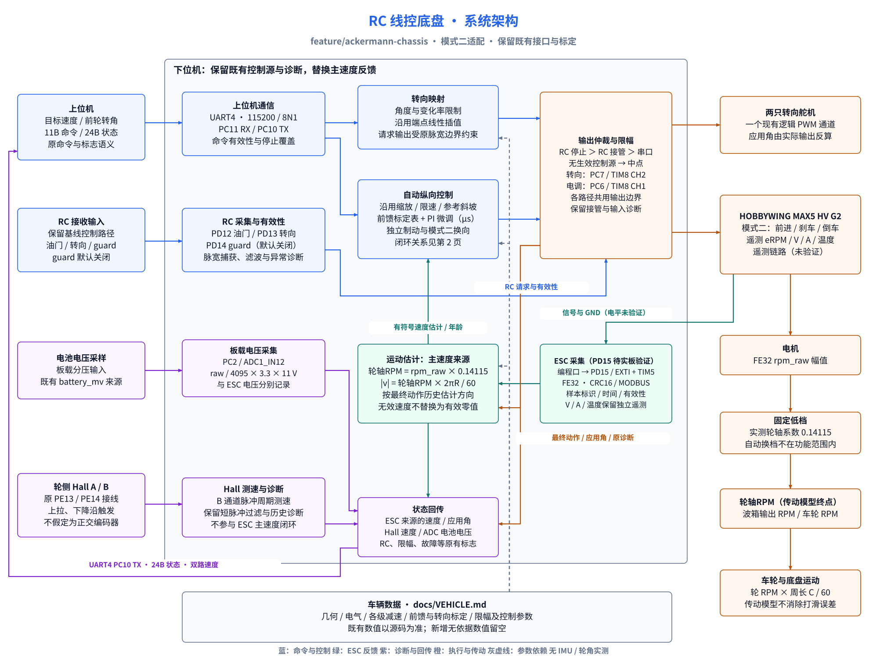
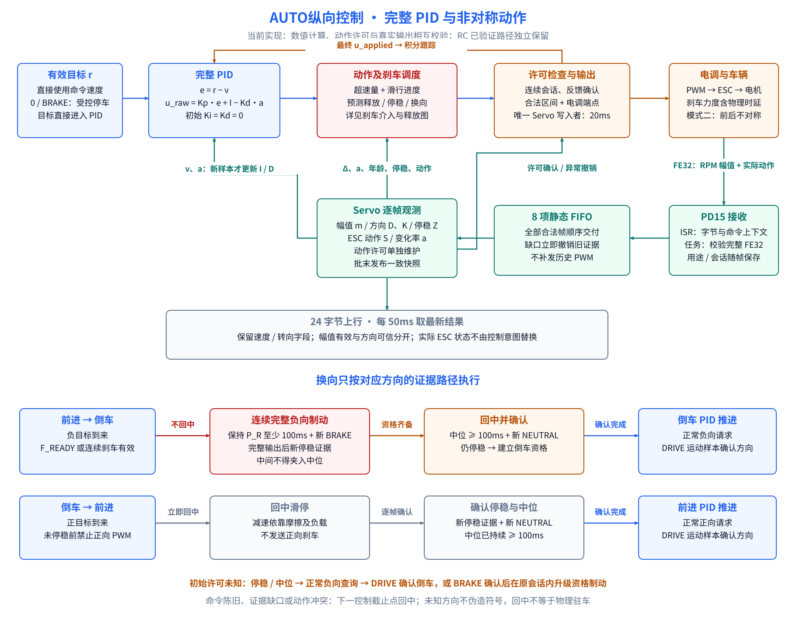
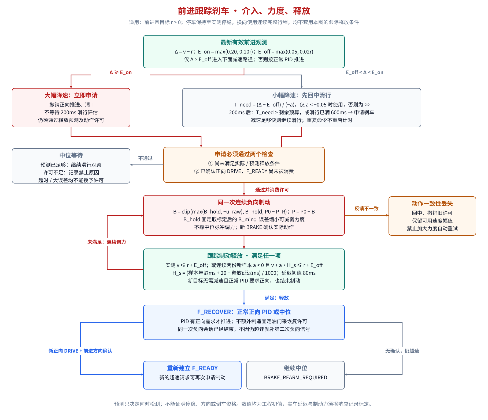

# 架构

本文描述当前`feature/symmetric-speed-control`分支的固件结构。`rc-validated-v1`冻结的是已验证RC观测基线；本分支的AUTO纵向控制采用完整PID和非对称模式二门控，PID增益、B_min和制动时序采用工程初值。已验证RC观测见[ESC观测与速度发布](ESC_OBSERVATION.md)，AUTO控制细节见[AUTO纵向控制实现说明](AUTO_CONTROL.md)。

固件以 `feature/ackermann-chassis` 为基线整理。保留下行命令、RC接管、停止覆盖、转向标定和板载电压采集；移除IMU等未安装设备的占位链路，适配电调模式二，并以ESC转速作为主速度反馈。上行另传独立Hall周期测速结果。电脑端收帧、原始回放和PD15实板合法帧/raw RPM变化均已验证；RC控制下的Hall与ESC有符号速度使用同一FE32动作反馈方向观测器。

要逐步理解“怎么知道前进/倒车、RC和AUTO各自维护什么、速度为什么不能随便补零”，从[ESC观测与速度发布](ESC_OBSERVATION.md)开始阅读。串口自动控制的动作许可和PID映射从[AUTO纵向控制实现说明](AUTO_CONTROL.md)开始阅读。



## 系统与数据归属

| 模块 | 输入 → 输出 | 职责 |
| --- | --- | --- |
| 上位机通信 | 串口报文 ↔ 目标命令、状态 | 下行保持11B；上行保持24B，字节3–6为Hall速度，字节7–8为ESC主速度 |
| RC 输入与输出仲裁 | RC、串口、停止覆盖 → 生效控制源 | PD12/PD13负责油门与转向接管；实物PD14未接线，固件不配置TIM4 CH3 |
| ESC 采集（PD15） | 编程口 → PD15 EXTI/TIM5 → 带时间与上下文的FE32样本 | A3链路已证实异常；115200/8N1位中心采样；伪起始位过滤，FE32校验后发布 |
| 观测队列 | 合法FE32样本、输出上下文 → 最新原始快照、8项观测FIFO | RC上下文和显式AUTO上下文都入队；源变化、上下文无效、队满形成delivery边界 |
| 运动估计 | rpm_raw、低档轮轴系数、轮胎半径、方向观测结果 → 车速 | 幅值与方向分离；RC与AUTO使用独立方向观测实例，共用幅值换算与停稳判定 |
| 纵向PID | 目标速度、有符号ESC反馈 → 相对中位的PID输出 | 目标速度直接进入PID；积分、微分和抗饱和均按实际输出与新反馈样本更新 |
| 模式二门控 | PID输出、FE32动作、停稳证据、最终PWM历史 → 可执行PWM | 按模式二非对称规则投影PID输出；F→R需连续负向资格，R→F先中位滑停 |
| 转向映射 | 前轮角、限幅与标定 → 舵机请求 | 保留转角、变化率与脉宽限制；回传为应用角估计 |
| Hall 与电压采集 | HallB 脉冲、板载 ADC → Hall 速度、诊断与电压 | Hall独立测速并随已确认方向赋符号；不进入AUTO主PID反馈 |

几何、电气、限幅及标定数据归属[车辆数据](VEHICLE.md)。两个转向舵机对应一个现有逻辑输出通道。Hall 不进入 ESC 主速度闭环，其独立速度供面板曲线对比；换向等待新脉冲对时无效，零命令无脉冲超时后单独标记推定停稳。24B 的 13–14 字节回传实际 ESC PWM，用于和速度对齐；ADC 电压保留在固件内部。

## ESC速度与方向

低档实测传动关系为：

```text
wheel_rpm = rpm_raw × 0.14115
|v| = wheel_rpm × 2π × 0.115 / 60
```

`0.14115`只描述ESC原始转速到轮轴，不包含轮胎。更换轮胎时修改轮胎半径，不重拟合传动系数；传动结构变化时重新配对标定。

FE32的RPM只提供幅值，byte11只提供`NEUTRAL / DRIVE / BRAKE`动作。RC方向不能由负向PWM或RPM单独推断：只有电调报告`DRIVE`时，实际PWM所在侧和新鲜运动证据才能确认方向；`BRAKE`与`NEUTRAL`保留最后确认的物理运动方向。方向未知时仍可观测ESC正幅值，但方向可信位清零且角速度不生成。

RC方向观测器与AUTO方向观测器相互独立。RC实例只服务上行符号、Hall方向提示和Dashboard曲线，不回写RC油门。AUTO实例增加purpose/session约束：只有与当前AUTO输出用途和会话匹配的DRIVE才能确认新方向，刹车用途不能自行证明倒车。AUTO在停稳后实际提交相反方向推进时先清除本AUTO实例的旧方向，等待新DRIVE反馈重新确认；RC实例不受这条AUTO换向清除规则影响。

## AUTO速度闭环



串口命令先进入mailbox，由Servo任务在20ms控制截止点消费；命令时间戳保持接收时刻，不因延后消费而刷新。AUTO目标直接取当前有效命令：`ENABLE=0`、`SOFTWARE_STOP`或命令超时会使本源输出中位；`BRAKE`把目标速度置零并走受控停车路径。

纵向控制器每20ms最多计算一次：

```text
e = r - v
u_raw = Kp × e + I - Kd × a
```

`r`为当前目标速度，`v`为有符号ESC反馈，`a`为同一方向的滤波加速度。当前工程初值为`Kp=120 µs/(m/s)`、`Ki=20 µs/[(m/s)·s]`、`Kd=0`；I/D代码路径存在，参数仍需实车标定。重复样本不增加积分时间；目标数值变化时本周期不追加误差积分。

模式二门控负责把`u_raw`投影为最终PWM：

| 阶段 | 最终PWM |
| --- | --- |
| 前进推进/恢复 | `P0 + clip(u_raw, 0, P_F-P0)` |
| 倒车推进/查询 | `P0 + clip(u_raw, P_R-P0, 0)` |
| 中位、等待、滑行、未授权 | `P0` |
| 前进跟踪/停车制动 | `P0 - clip(max(B_min, -u_raw), B_min, P0-P_R)` |
| F→R资格制动 | `P_R` |

当前物理端点为`P_R=1000 µs`、`P0=1500 µs`、`P_F=2000 µs`。模式二门控按动作许可把PID输出投影到这些端点定义的合法区间。

## AUTO模式二约束



| 场景 | 动作关系 |
| --- | --- |
| 前进加速或稳速 | 正向PID推进；新鲜FORWARD_REQUEST上下文的DRIVE及前进运动建立F_READY |
| 前进减速 | 先撤销多余推进；大超速立即申请刹车，小超速先滑行，再按减速进度与剩余预算申请。执行刹车须消耗F_READY，保持一次连续负向会话 |
| 前进停车 | 有F_READY时进入同一次负向制动，直到动作开始后的停稳证据成立，再回中 |
| 前进转倒车 | 连续负向制动升级为REVERSE目的；最终PWM实际到达1000 µs并保持至少100ms，收到该完整输出之后的BRAKE和停稳证据，再回中驻留，随后允许倒车PID推进 |
| 倒车减速或停车 | 只减少倒车推进或输出中位滑停；不输出正向刹车 |
| 倒车转前进 | 输出中位滑停，确认停稳与中位反馈后按正目标启动；当前AUTO不使用R→F正向刹车路径 |
| 启动或证据缺口 | 状态为UNKNOWN；停稳后按当前目标发起正向启动或倒车查询，必须由后续匹配样本确认方向 |

前进跟踪制动释放后进入F_RECOVER。若仍超速但尚未重新取得正向DRIVE确认，门控报告`BRAKE_REARM_REQUIRED`并保持中位，不能自动补第二次负向信号。这个约束保留了模式二安全边界：负向信号在某些电调状态下可能从刹车变成倒车推进。

## 观测与时序

PD15接收任务逐字节解析FE32，保存每帧末字节时间、首字节软件输出上下文、receive epoch和delivery epoch。每个字节采集时读取两个上下文字：一个包含PWM、RC标志和source generation，另一个包含AUTO purpose、session和AUTO标志。输出提交先准备非活动上下文槽，再在同一短PRIMASK临界区写CCR并提交槽索引。帧内source必须一致；帧内PWM和metadata允许变化，整帧按首字节上下文解释。

RC或显式AUTO上下文的合法样本进入同一个8项FIFO。Servo任务在样本通知或20ms控制入口消费入口已有队列，不追赶生产者，不因为通知而额外写PWM。样本事件可以更新观测、方向、停稳、PID反馈和快照；实际ESC输出只在20ms控制截止点提交。

上行任务每50ms取最新控制快照。动作颜色可能被降采样；内部状态转换以逐帧FIFO为准，不能用Dashboard是否显示某种颜色判断固件是否处理过该动作。

## 运行边界

输出仲裁沿用基线：普通RC接管优先于串口源；无生效控制源时输出中点。RC油门通过合法性和毛刺确认后保留接收机完整脉宽，不经过自动推进端点裁剪。RC方向观测失败只使有符号速度无效，不能改变、限制或锁死RC输出。实物没有PD14 guard输入，固件也不采集PD14。串口SOFTWARE_STOP是该命令源的停止覆盖，不是故障锁存；CLEAR_FAULT的受理条件与诊断语义见[接口约束](INTERFACES.md)。

ESC反馈无效、关键观测缺失、时间倒序、队列交付缺口、配置无效或模式二动作冲突时，AUTO输出中位，清受影响的动作证据和PID动态状态，不回退到Hall测速。控制源、配置或RX边界通过运动估计器的`EXTERNAL_OVERRIDE`动作写入边界时间栅栏；边界前样本不能证明边界后的停稳，仍新鲜的RPM幅值不被伪造或改写。恢复自动推进前需要重新取得新鲜FE32、停稳和动作许可。

24B状态位25–31直接报告AUTO授权、PID活动、跟踪刹车、R_READY、许可/动作不完整、AUTO禁止和完整PID/非对称门控配置有效状态。速度、转向、Hall和电压字段的单位及符号语义不随AUTO状态改变。
