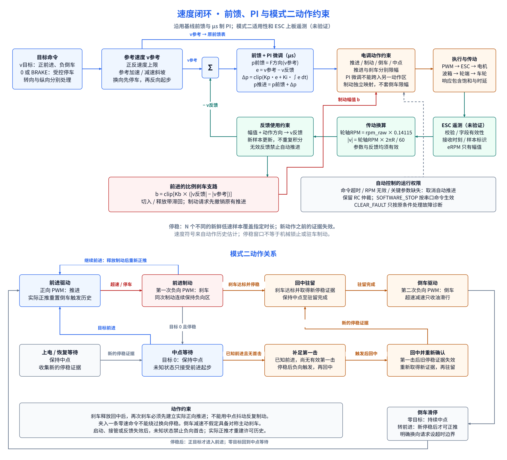

# 架构

固件以 `feature/ackermann-chassis` 为基线整理。保留下行命令、RC 接管、停止覆盖、转向标定和板载电压采集；移除 IMU 等未安装设备的占位链路，适配电调模式二，并以 ESC 转速作为主速度反馈。上行另传独立 Hall 周期测速结果。电脑端收帧、原始回放和PD15实板合法帧/raw RPM变化均已验证；上行速度使用低档轮轴实测系数，闭环控制效果仍待验证。

图定义组件与数据流，文字定义接口条件和控制规则。

## 系统与数据归属

[draw.io 图源](diagrams/chassis.drawio)包含系统架构与速度环两页。实线表示信号或传动关系，虚线表示参数依赖。

| 模块 | 输入 → 输出 | 职责 |
| --- | --- | --- |
| 上位机通信 | 串口报文 ↔ 目标命令、状态 | 下行不变；上行字节 3–6 改传 Hall 速度，增加独立有效/停稳位，仍为 24B |
| RC 输入与输出仲裁 | RC、串口、停止覆盖 → 生效控制源 | PD12/PD13负责油门与转向接管；实物PD14未接线，固件不配置TIM4 CH3 |
| ESC 采集（PD15） | 编程口 → PD15 EXTI/TIM5 → 带时间与有效性的遥测 | A3链路已证实异常；115200/8N1位中心采样；伪起始位过滤，FE32校验后发布 |
| 运动估计 | rpm_raw、低档轮轴系数、轮胎半径、最终动作历史 → 车速 | 幅值与方向分离；自动停稳/模式二许可仍单独门控 |
| 纵向控制 | 目标速度、车速 → 推进、跟踪刹车、停车或换向意图 | 独立处理目标斜坡、前馈、PI、制动滞回；不直接决定模式二动作许可 |
| 模式二门控 | 控制意图、停稳证据、最终PWM历史 → 可执行动作 | 对称管理两个方向的连续刹车、回中驻留、反向解锁与超时禁止 |
| 转向映射 | 前轮角、限幅与标定 → 舵机请求 | 保留转角、变化率与脉宽限制；回传为应用角估计 |
| Hall 与电压采集 | HallB 脉冲、板载 ADC → Hall 速度、诊断与电压 | Hall 采用相邻脉冲周期测速，上行速度/有效性使用同一快照；RC方向只在刹停、回中、第二次目标输入后对称换向 |

几何、电气、限幅及标定数据归属[车辆数据](VEHICLE.md)。两个转向舵机对应一个现有逻辑输出通道。Hall 不进入 ESC 主速度闭环，其独立速度供面板曲线对比；换向等待新脉冲对时无效，零命令无脉冲超时后单独标记推定停稳。ESC 电压作为独立遥测量，不替换既有电池电压字段。

## 速度闭环

低档实测传动关系为`轮轴RPM = rpm_raw × 0.14115`，只描述ESC原始转速到轮轴，不包含轮胎。车速幅值为`|v| = 轮轴RPM × C / 60`，当前`C = 2π × 0.115 m`。更换轮胎时修改轮胎半径，不重拟合传动系数；若传动结构变化则重新配对标定。方向依据最终生效的电调动作历史估计，不能由负向PWM或遥测原始状态直接推断。方向未知时仍可观测正幅值，但方向可信位清零且角速度不生成；控制器不能把该正值解释为前进。

自动纵向控制先产生意图，再由模式二门控决定可执行动作。纵向控制器的意图包括中位、推进、跟踪刹车、停车刹车和换向请求；门控只能收紧权限，不能把被禁止的推进改成另一种推进。

推进沿用基线的**前馈脉宽＋PI 微调**：

- 精确零目标表示停车；任意有限非零目标直接进入唯一的参考速度斜坡，得到`v参考`，不设软件速度死区或目标上限。方向取最新命令，幅值单独斜坡；命令变号先把旧幅值归零。
- 基准脉宽 `p前馈 = F方向(v参考)`，取自原前进／倒车标定表。
- `e = v参考 − v反馈`，`Δp = clip(Kp·e + Ki·∫e dt, −Δp上限, +Δp上限)`，单位为 µs。
- 推进请求为 `p前馈 + Δp`，受对应动作的输出边界约束；微调不能跨入另一动作区。

PI 保留抗积分饱和和换向清积分约束；使用新鲜 ESC 样本更新反馈，重复读取同一样本不增加积分时间。原表和原增益在模式二下的效果标注为未验证，不能将 µs 制增益直接当作归一化出力增益。

同方向实际速度高于参考速度时使用独立比例刹车 `b = clip(Kb·(|v反馈| − |v参考|), 0, b上限)`。前进减速使用中位以下的刹车侧，倒车减速使用中位以上的刹车侧；切入与释放带滞回，制动请求先撤销原有推进。刹车脉宽端点、跟踪刹车增益和滞回阈值单独标定，不套用推进限幅。

## 模式二约束

| 场景 | 动作关系 |
| --- | --- |
| 前进减速或停车 | 中位以下的反向侧信号作为刹车，同一次制动连续保持 |
| 前进转倒车 | 连续负向刹车达到F→R最终PWM差值与保持时间 → 新停稳证据 → 回中驻留 → 负向推进 |
| 倒车减速或停车 | 中位以上的正向侧信号作为刹车，同一次制动连续保持 |
| 倒车转前进 | 连续正向刹车达到R→F最终PWM差值与保持时间 → 新停稳证据 → 回中驻留 → 正向推进 |
| 启动或控制历史失效 | 状态记为UNKNOWN_SAFE；停稳时只允许用户请求对应的正向PWM，必须由探测开始后的新鲜运动样本确认方向；禁止直接猜测倒车许可 |
| 证据矛盾 | 进入不确定状态并输出中点，不自动尝试更强刹车 |

资格判定以**最终实际输出PWM**相对中点的差值为准，不以前级归一化请求替代。F→R固定输出1000 µs，R→F固定输出2000 µs，均连续保持至少100 ms；只有完整500 µs差值、新停稳证据和回中驻留全部成立才允许相反方向推进。回中之后绝不在同一序列中发送刹车重试。夹入零速命令也不能绕过停稳与驻留要求。

软件复位或清除历史不代表电调已经复位。首次启动、RC 接管和反馈失效之后，电调许可状态按未知处理；新停稳证据只能证明低速，不能证明下一次同侧输入究竟是刹车还是推进。自动路径禁止未知状态下直接发出负向动作。明确请求前进且已停稳时，输出纵向控制器计算的正向PWM；软件继续保持方向未知，直到该动作之后的新鲜RPM样本超过停稳阈值，才进入FORWARD_TRACKING并允许有符号速度。机械响应慢不会触发控制故障；命令或反馈失效才回中。人工RC输出仍保持直通；Hall符号使用独立的对称模式二观察状态机。

停稳要求多个不同的新鲜低速样本覆盖设定时长。新的推进、制动或首击动作使此前证据失效；连续保持同一制动动作时，可积累动作开始之后的低速样本，重复读取同一样本不能累计证据。停稳窗口不等于机械锁止或驻车制动。

## 运行边界

输出仲裁沿用基线：普通RC接管优先于串口源；无生效控制源时输出中点。RC油门通过合法性和毛刺确认后保留接收机完整脉宽，不经过自动推进端点裁剪。实物没有PD14 guard输入，固件也不采集PD14。串口SOFTWARE_STOP是该命令源的停止覆盖，不是故障锁存；CLEAR_FAULT的受理条件与诊断语义见[接口约束](INTERFACES.md)。

ESC 反馈无效或关键观测、停稳、制动、模式二参数缺失时禁止自动闭环推进，不回退到 Hall 测速；恢复自动推进前重新取得停稳证据。仓库默认配置已经完整有效，正常收到新鲜FE32与停稳样本后即可授权串口速度控制。24B状态位25–31直接报告授权、闭环、跟踪刹车、解锁、不确定、禁止和配置有效状态。转向与 RC 路径保留基线的输入有效性、限幅和停止处理。
