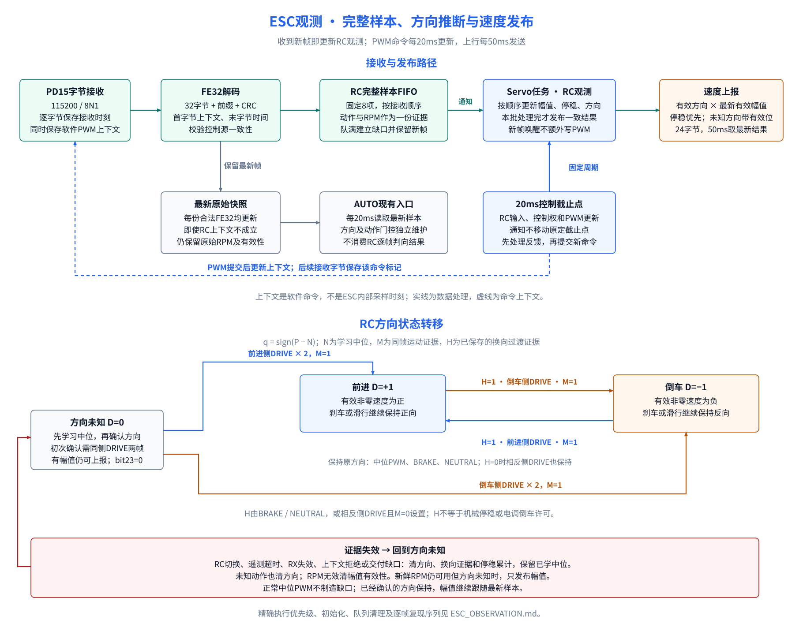

# ESC观测与速度发布设计说明

本文规定从PD15接收字节到RC/AUTO观测、有符号ESC速度、Hall方向提示及24字节上行相关字段的处理算法。给定相同的字节、接收时刻、PWM命令、控制源切换和配置，应得到相同的方向、停稳与有效性结果。

RC输入过滤及控制权仲裁负责提供“最终PWM”和“RC是否生效”两个输入；AUTO闭环属于独立模块，本文定义其共享接收接口和切换边界，不重定义其控制算法。系统结构见[ARCHITECTURE.md](ARCHITECTURE.md)，完整上下行布局见[INTERFACES.md](INTERFACES.md)。



## 1. 数据模型与默认参数

### 1.1 测量量与推断量

| 名称 | 来源 | 精确定义 |
| --- | --- | --- |
| RPM原始幅值 R | FE32字节13–14 | 无符号16位，小端；`FFFF`无效 |
| ESC动作 S | FE32字节11 | 0=NEUTRAL，1=DRIVE，2=BRAKE，其他值无效 |
| 速度幅值 v_abs | R及车辆配置 | 轮轴系数与轮胎半径换算后的非负速度 |
| 方向 D | 方向观测器；RC和AUTO各自独立实例 | 0=未知，+1=前进，−1=倒车；是推断量 |
| 停稳 Z | 多份低速样本 | 低速样本数量及其接收时间跨度同时达标 |
| 最终PWM P | C63A输出命令 | 软件提交的ESC脉宽，单位µs；不是PWM引脚回读 |

DRIVE不能单独区分前进/倒车；BRAKE不能单独确定车辆运动方向；NEUTRAL不能单独证明停稳。当前硬件没有独立方向传感器。

### 1.2 默认值

| 参数 | 值 | 用途 |
| --- | --- | --- |
| 串口电平接口 | PD15，115200 / 8N1 | FE32输入 |
| 合法帧长度 | 32字节 | FE32校验和解码 |
| 字节环 | 256槽，实际最多255项 | ISR与接收任务交接，保留一个空槽判满 |
| 观测样本FIFO | 8项 | RC上下文或显式AUTO上下文按顺序消费；8项全部可用 |
| 接收任务 | 每轮处理后延时2ms | 排空字节环、解析、通知 |
| 控制计算周期 | 20ms | RC仲裁和PWM命令更新、AUTO计算 |
| 上行周期 | 50ms | 发送最新控制快照 |
| 新鲜度 T | 250ms，含端点 | 年龄不大于T才有效 |
| 轮轴系数 k | 0.14115 | wheel_rpm / rpm_raw |
| 轮胎半径 r | 0.115m | 速度换算 |
| 低速阈值 v_stop | 0.05m/s，含端点 | v_abs≤v_stop计入停稳 |
| 停稳样本数量 n_stop | 3份 | 不同样本 |
| 停稳跨度 t_stop | 150ms，含端点 | 最后减第一份低速样本的接收时间 |
| 初次方向确认 | 2份 | 不同DRIVE样本，同一非中位PWM侧且有运动证据 |
| 中位候选窗口 | 5项 | 最近候选的排序中位值 |

运行配置来源为`app_vehicle_config.h`及对应运行变量。固定250ms等数值是默认配置，不应在复现时误写成绕过运行配置的常量。TIM8的PWM载波约380Hz；20ms是软件命令更新周期，两者不同。

### 1.3 逻辑记录

记录结构按字段含义定义，不要求内存布局与网络布局相同。

```text
ByteItem:
    byte: u8
    received_ms: u32            // 本字节接收完成时刻
    output_context: u32        // 同时读取的PWM/source上下文
    output_metadata: u32       // 同时读取的purpose/session上下文

Sample:
    sample_id: u32
    received_ms: u32            // 合法帧最后字节的时刻
    raw[32]
    state_raw: u8
    state_valid: bool
    rpm_raw: u16
    rpm_valid: bool
    // 电压、电流、温度等解码字段，不参与本方向判定

ObservedSample:
    sample: Sample
    receive_epoch: u32
    delivery_epoch: u32
    output_context: u32        // 合法帧首字节保存的PWM/source上下文
    output_metadata: u32       // 合法帧首字节保存的purpose/session上下文
```

上下文由两个32位字组成。第一个字打包PWM、RC标志和source：

```text
context = (source_generation << 13) | (rc_active << 12) | (P & 0xFFF)
P = context & 0xFFF
rc_active = (context >> 12) & 1
source_generation = context >> 13
```

第二个字打包AUTO元数据：

```text
metadata = (auto_context << 31) | ((session_id & 0x0FFFFFFF) << 3) | purpose
purpose = metadata & 0x7
session_id = (metadata >> 3) & 0x0FFFFFFF
auto_context = (metadata >> 31) & 1
```

`purpose`取`NEUTRAL / RC_DIRECT / FORWARD_REQUEST / REVERSE_REQUEST / FORWARD_BRAKE`。`source_generation`首次发布取1，只在RC标志改变时增加；超过19位范围后回到1。普通PWM、purpose或session变化不增加source。代号0表示上下文尚未初始化。

## 2. 接收、解码和样本交付

### 2.1 PD15接收契约

下降沿启动软件UART采样。TIM5时基84MHz，起始位复核、8个数据位及停止位采样偏移依次为：

```text
365, 1094, 1823, 2552, 3281, 4010, 4740, 5469, 6198, 6927 ticks
```

起始位半位处已回高视为伪起始位：计数后重新监听，不建立接收失效边界。停止位错误、采样迟到超过250个TIM5 tick、字节环溢出进入接收错误路径，由服务任务处理故障并建立接收边界。

每个成功字节同时保存本地毫秒时刻和两个32位上下文字。输出侧先准备非活动槽里的PWM/source字和purpose/session字，再在同一个短PRIMASK临界区完成实际CCR写入与上下文槽索引提交；PD15 ISR固定读取已发布槽并复制两个字。该临界区只覆盖这段写CCR与提交索引的小序列，不改变RC输入捕获和TIM5位采样的设计。ISR不解析FE32、不调用RTOS、不更新方向状态。

接收任务先处理RX错误，再排空字节环，逐字节传入解码器。完成一批解析或处理RX错误后通知Servo任务一次。通知可合并，样本不能因此合并。

### 2.2 FE32组帧

字节偏移从0开始：

| 偏移 | 判定/解码 |
| --- | --- |
| 0–4 | 固定前缀`FE 01 00 03 30` |
| 9、10 | 请求/实际油门原始字节；本观测器不用于判向 |
| 11 | S；0/1/2有效，其他值动作无效 |
| 13–14 | `R=byte13 | byte14<<8`；R≠65535时RPM有效 |
| 30–31 | 前30字节的CRC，小端 |

CRC为MODBUS反射算法：初值`FFFF`，逐字节异或低8位，每字节迭代8次；最低位为1时右移后异或`A001`，否则仅右移；无最终异或。

解码过程：

1. 丢弃候选缓冲中第一个`FE`之前的字节。
2. 检查已有前缀字节；不匹配时移除候选首字节并重新搜索。
3. 满32字节后校验CRC；失败时移除候选首字节并重新同步。
4. 成功时生成Sample，记录末字节时刻，分配当前sample_id，然后sample_id增加，清候选缓冲。

sample_id从1开始，按u32自然回绕。CRC失败不生成样本、不增加sample_id，也不直接建立receive/delivery边界。因此本地样本号连续不能证明线上没有坏帧，更不能证明ESC内部每次状态变化均有发送。

速度换算使用R本身，不使用解码器另存的`erpm_candidate=R×10`；混用会产生10倍误差。

### 2.3 帧与PWM关联

解码器另外保存最近32个字节的上下文：

- 全部32项的source_generation必须非零且相同。
- 条件成立时，取首字节的上下文作为整帧上下文。
- 帧中同一控制源的PWM、purpose和session可以变化；不改用末字节上下文，不因此判上下文失效。
- 条件不成立时，该帧仅进入最新原始快照，不进入观测FIFO，并按2.5建立交付边界。

上下文表示首字节接收完成时已提交的软件命令。它排除后来命令对旧帧的解释，但不等于ESC内部采样时刻；PWM预装载和电调内部反馈延迟不由该标记消除。

### 2.4 最新快照与FIFO

每份合法Sample均先更新最新原始快照。该更新与以下FIFO处理必须对Servo任务原子可见：

| 当前帧条件 | FIFO动作 | 最新原始快照 |
| --- | --- | --- |
| 上下文无效 | 清空旧FIFO，增加delivery_epoch | 保留当前合法帧 |
| 有效上下文，但source与接收层记住的上一有效source不同 | 清空旧FIFO，增加delivery_epoch，再处理当前帧 | 保留当前合法帧 |
| 有效上下文，但既非RC也非显式AUTO | 不入队，计入丢弃统计 | 保留当前合法帧供幅值诊断 |
| 有效RC或显式AUTO上下文，FIFO未满 | 加到队尾 | 保留当前合法帧 |
| 有效RC或显式AUTO上下文，FIFO已满8项 | 丢弃全部8项，增加delivery_epoch，再入当前帧 | 保留当前合法帧 |

“上一source”是接收层上一份上下文有效且source非零的合法帧的来源，不要求该帧是RC、AUTO、已入队或已被Servo消费。首份有效上下文只建立记忆，不因首次建立而增加delivery_epoch；source变化分支在建立边界后记住当前source。弹出一项按FIFO顺序返回；弹空无效果。`DiscardSamples`仅在FIFO非空时清空并增加delivery_epoch。

### 2.5 三种代号

| 代号 | 增加条件 | 清理规则 |
| --- | --- | --- |
| receive_epoch | RX错误、接收重启，以及兼容接收接口报告的缓冲/位置错误 | 清待解析块、观测FIFO和上下文窗口；最新原始快照失效；请求解析器复位；同时增加delivery_epoch |
| delivery_epoch | 上述接收边界、上下文拒绝、已观察source变化、FIFO满、显式丢弃非空FIFO | 清上一source识别记忆；对应路径按2.4清FIFO |
| source_generation | 软件提交PWM时RC标志改变 | 标记控制源阶段；本身不表示硬件或接收错误 |

receive/delivery从1开始，u32增加后若为0则跳到1。接收重启会保留解析器下一sample_id；若该值已回绕为0，复位时改为1。source使用独立19位循环代号。

接收错误与软件交付缺口分别计数，不能将FIFO溢出直接记作PD15采样错误。

## 3. 单一状态所有者与任务时序

接收任务只修改解析、原始快照及FIFO生产端。Servo任务独占运动估计器、RC方向观测器和AUTO门控；上行任务读取发布快照。每个任务各自控制的状态不能由另一个任务直接推进。

Servo任务同时等待样本通知和20ms控制截止点：

```text
next = 当前RTOS tick
循环:
    now = 当前RTOS tick
    若 u32(now - next) < 2^31:
        执行一次20ms控制过程
        finish = 当前RTOS tick
        periods = floor(u32(finish-next) / 20) + 1
        next = next + periods*20
    否则:
        执行一次RC观测入口
    等待通知，最长等待到next
```

此处RTOS tick为1ms。通知不移动next；过期的控制周期不补发PWM。20ms控制过程按顺序执行：

1. 刷新运行配置；若当前已是RC则消费RC反馈，否则消费AUTO反馈。
2. 更新RC输入与控制权。
3. 按取得控制权的源输出PWM；提交输出后更新32位上下文。
4. 更新Hall方向提示，发布快照。

样本通知入口在RC生效时消费RC反馈，在非RC时消费AUTO反馈；两者都会更新运动估计、方向/动作证据、Hall提示和快照。样本通知不写PWM，不运行RC输入计数，也不把历史队列补发成输出。无新样本时仍通过控制截止点检查陈旧与失效。

源切换时，清FIFO、清RC方向及停稳证据，重新初始化运动估计器，并使旧AUTO执行历史失效；学习中位保留。边界同时用`ESC_MOTION_APPLIED_ACTION_EXTERNAL_OVERRIDE`和边界时刻写入运动估计器的时间栅栏：边界前的样本不能证明边界后的停稳，仍新鲜的RPM幅值本身不被伪造或改写。新输出上下文在后续PWM提交时生成。旧source的帧即使晚解析，也不能建立新RC或AUTO阶段的方向/动作许可。

初始化顺序为接收模块初始化、Servo初始化并发布初始中位命令上下文，最后启动输入接收；避免Servo发布的上下文被接收模块初始化覆盖。

## 4. RC一次观测的确定顺序

入口锁定本轮待处理数量B（最多8）、delivery_epoch和最新原始快照。随后到达的帧不延长本轮循环。

1. delivery_epoch与消费者保存值不同：执行“清RC证据”，然后记住新值。
2. 最新原始快照不存在：标记RX无效，清当前原始样本有效性及RC证据，刷新估计后返回。
3. 对最多B项依次弹出，严格按下表处理。
4. FIFO耗尽后，若最新原始快照的sample_id/receive_epoch还未被估计器入口消费，进入“仅幅值路径”。
5. 当前已处理FE32不再新鲜时清RC证据；再次检查delivery_epoch；刷新估计。
6. 更新最终Hall方向提示，发布一次完成本批后的快照。

步骤3按优先级执行：

| 顺序 | 条件 | 操作 |
| --- | --- | --- |
| 1 | 项的receive_epoch不等于本轮最新快照，或source不是当前源，或RC标志为0 | 计数后跳过 |
| 2 | 项的delivery_epoch不同 | 清RC证据，记住该代号，继续检查本项 |
| 3 | 接收时间在未来半区间、T=0或年龄>T | 计数，清RC证据，跳过 |
| 4 | sample_id与receive_epoch均等于最后消费值 | 跳过重复项 |
| 5 | 其余 | 保存为当前样本；更新幅值/停稳；以同一份估计的M、该帧S和首字节PWM更新方向 |

时间差统一为u32减法。差值≥`0x80000000`视为时间顺序无效，差值为0允许；因此计时回绕不需要直接比较绝对时间大小。

“清RC证据”清D、K、H、初次确认计数、中位学习未完成配对、观测器最后样本标志及停稳计数，保留已学习中位及其候选窗口，也不清除尚未过期的幅值存储。控制源切换额外重新初始化运动估计器。

**仅幅值路径**先清RC证据。原始样本年龄有效时，将其RPM送入估计器并记录为已消费，随后再次清停稳证据；不调用方向确认。该路径允许上下文被拒绝的合法帧继续提供幅值，但不能提供方向或停稳资格。

一个批次内每次确认方向改变，立即更新Hall方向提示以使旧周期失效；批次完成后再给出最终方向，避免批内两次换向被最终同号掩盖。对外ESC快照只发布批次完成后的结果。

## 5. 幅值、运动证据和停稳

### 5.1 有效性与换算

幅值配置要求k、r有限且>0，0<T<2^31，换算比例有限、为正且可用float表示。停稳配置还要求v_stop有限且>0、n_stop≥2、0<t_stop<2^31。

```text
wheel_rpm = double(R) * double(k)
v_abs = float(wheel_rpm * 6.28318530717958647692 * double(r) / 60)
```

非有限、负值、超过float范围，或非零R换算后变为非正值，均判换算无效。R为0时允许v_abs为0。

新鲜有效样本更新幅值；新样本RPM或换算无效时，当前幅值立即不可用并清停稳计数，不沿用上一份有效幅值。样本之间可以重复发布尚新鲜的同一幅值，但不修改其接收时刻。

幅值配置变化清幅值和停稳状态；仅停稳配置变化清停稳状态。配置在控制周期入口读取。

### 5.2 运动证据M

M=1必须同时满足：有新鲜有效幅值、停稳配置有效、v_abs>v_stop，并且估计器的sample_id与送入方向观测器的FE32一致。

M=0可能表示低速、RPM无效或配置不可用，不能解释为“已经停稳”。

### 5.3 停稳累计

每个不同、时间顺序合法的新样本按以下规则处理：

- 相邻样本接收间隔>T：先清旧停稳累计。
- 若存在动作证据起点，样本接收时刻必须严格晚于起点；否则清停稳累计且不计入。
- RPM/换算无效或v_abs>v_stop：清停稳累计。
- 合格低速样本：首份记n=1和t_first；后续增加n，更新t_last。
- n≥n_stop且u32(t_last−t_first)≥t_stop时置Z=1；重复sample_id不增加n。

低速阈值只用于运动/停稳证据，不把每个低速样本立即改写为零。只有停稳发布条件成立，上行才优先输出零。

方向记忆不会仅因Z成立而删除；上行仍会清bit23、bit6并置bit12。发生源切换、交付缺口或仅幅值路径时按第4节清停稳资格。

## 6. RC方向算法

### 6.1 状态与初值

| 变量 | 含义 | 完整初始化 |
| --- | --- | --- |
| D | 确认方向，0/+1/−1 | 0 |
| K | 方向输出有效 | 0 |
| N、L | 学习中位与已建立标志 | 0、0 |
| H | 换向过渡证据 | 0 |
| C、c | 初次方向候选与计数 | 0、0 |
| I_last、has_I | 已处理样本标识 | 0、0 |
| 中位候选窗口与配对 | 最近最多5项及稳定配对状态 | 空 |

D、H是观测器状态，不是电调内部方向许可。q定义为`sign(P−N)`，中位P=N时q=0；无额外方向死区。

### 6.2 中位学习

只接受新鲜、新sample_id的NEUTRAL，且RPM有效、R=0、P非零：

1. 无未完成配对或P与配对PWM不同：保存P，配对计数置1。
2. 第二份相同P产生候选；候选写入最多5项的循环窗口。
3. 按升序排序，取索引`count/2`（整数除法）的值作为N并置L=1；偶数项取上中位。
4. 产生候选后配对计数回到1，允许下一份同P与本份重叠配对。

非NEUTRAL或不满足学习条件清配对，不删除候选窗口。完整初始化清窗口；方向复位、RC退出和遥测失效保留窗口。

### 6.3 入口与动作分支

按以下顺序匹配，命中后不执行后续入口分支：

| 顺序 | 条件 | 操作 |
| --- | --- | --- |
| 1 | RC未生效或遥测不新鲜 | 清方向与未完成确认、H、中位配对及has_I；保留学习中位 |
| 2 | sample_id等于I_last且has_I=1 | 保持状态；不重复确认或学习 |
| 3 | 新样本 | 更新I_last与has_I，按S处理 |

动作处理：

| S | 操作 |
| --- | --- |
| NEUTRAL | 执行中位学习，清C/c；D已知时K=1、H=1 |
| BRAKE | 清中位配对和C/c；D已知时K=1、H=1 |
| DRIVE | 清中位配对，按6.4处理 |
| 其他值 | 清D/K/H及C/c、中位配对；保留学习中位 |

### 6.4 DRIVE优先级表

表中每行只有在前面条件均不成立时才执行。`清候选`表示C=0、c=0。

| 优先级 | 条件 | D、K | H | C、c |
| --- | --- | --- | --- | --- |
| 1 | L=0 | D保留，K=0 | 保留 | 清候选 |
| 2 | q=0 | D保留，K=(D≠0) | 保留 | 清候选 |
| 3 | M=0 | D保留，K=(D≠0) | D已知且q≠D时置1，否则保留 | 清候选 |
| 4 | D已知且q≠D且H=0 | D保留，K=1 | 保留0 | 清候选 |
| 5 | D已知且q≠D且H=1 | D=q，K=1 | 清0 | 清候选 |
| 6 | D已知且q=D | D保留，K=1 | 清0 | 清候选 |
| 7 | D未知且C≠q | D=0，K=0 | 保留 | C=q，c=1 |
| 8 | D未知且C=q | c增加到2后D=q、K=1 | 确认时清0 | c最多2 |

由优先级可知：q=0不设置H，M=0也不能越过q=0分支；已有H时经过中位不会清H。未知动作清方向，而不是作为“非DRIVE”设置H。

初次确认需要两份样本；已有方向的换向只需一份满足条件的相反侧DRIVE。换向不额外要求停稳3帧/150ms。H来自BRAKE、NEUTRAL，或相反侧DRIVE但M=0；因此H本身不是机械零速或倒车许可证明。

### 6.5 输出

K=1时输出D，否则输出未知。原因码独立于有效性：`PWM_AT_NEUTRAL`可与K=1同时存在。`awaiting_non_drive_before_reversal`等于`D≠0且H=0`。

内部方向D可以在停稳时保留；协议bit23仍受第7节停稳优先规则覆盖。不能将D直接当作报文bit23。

## 7. 上行与Hall接口

### 7.1 ESC发布规则

下表按停稳优先执行；bit属于24字节报文的u32状态字段。

| 条件 | ESC字段（字节7–8） | bit6 | bit12 | bit23 |
| --- | --- | --- | --- | --- |
| 有效反馈且确认停稳 | 0 | 0 | 1 | 0 |
| 幅值有效、方向已知、未停稳 | D×v_abs | 1 | 0 | 1 |
| 幅值有效、方向未知、未停稳 | +v_abs | 1 | 0 | 0 |
| 幅值无效、未确认停稳 | 0占位 | 0 | 0 | 取决于方向状态，不可单独使用 |

单位为mm/s：将速度m/s乘1000，截断向零并饱和到i16范围−32768…32767，按大端写字节7–8。bit6与bit12互斥。

动作取当前已处理的新鲜样本，字节1高两位编码为`00 UNKNOWN / 01 NEUTRAL / 10 DRIVE / 11 BRAKE`。编码与FE32原始动作值不同。动作不新鲜或字段未知时为UNKNOWN。

bit20表示新鲜合法FE32，bit21表示该样本RPM字段有效，bit22表示幅值配置有效，bit24表示PD15接收错误历史。上下文拒绝/FIFO溢出不伪装成bit24。没有方向或幅值依据时角速度反馈无效/填零；停稳时车速与角速度均为零。

控制反馈可用性另有边界条件：接收链未失效、幅值有效，并且无已记录的控制历史边界，或样本接收时刻严格晚于该边界。上行停稳有效还要求该控制反馈可用、停稳配置有效及Z=1；控制源切换前的样本不能证明切换后停稳。

独立ESC速度字段的幅值有效性不检查上述控制历史边界，只检查接收链、幅值配置、样本存在性、新鲜度、RPM及换算有效性。因此边界前但仍新鲜的样本，可以通过仅幅值路径出现在字节7–8；没有当前RC上下文时bit23=0。完整Ackermann反馈和角速度则使用控制反馈可用性与方向条件，不能从bit6单独推导其可用。上行取同一控制快照中的ESC数值及状态，不自行重新计算方向。

### 7.2 Hall方向提示

RC下，K=1且ESC未确认停稳时传递D，否则传递0。批内每次方向改变都触发Hall更新，批末再传递最终值。

Hall周期速度独立采集。相反方向提示使旧周期失效，等待新方向的脉冲对。当前Hall收到提示0不立即删除旧符号，因此ESC方向未知不能推导为Hall立刻无效。Hall数值及其bit13/bit19独立于ESC有效位。

### 7.3 Dashboard

Dashboard在bit12=1时显示零，否则仅在bit6=1且bit23=1时使用有符号ESC速度。其他情况不画有符号速度，幅值可作为独立观测展示。颜色只由上行动作码决定。

上行每50ms取最新结果，不保证显示每个内部动作；缺少某种颜色不能证明RC观测器没有处理过该动作。当前Dashboard不对无效有符号速度插值或补零。

## 8. 复现用输入序列

以下表除特别说明外均为同一RC/source/receive阶段的新鲜不同样本，幅值和停稳配置有效。P单位µs，v_abs单位m/s。

| 序列 | 前置状态 | 输入 | 预期结果 |
| --- | --- | --- | --- |
| 学中位 | 完整初始化 | 两份NEUTRAL、R=0、P=1500 | N=1500，L=1，D仍未知 |
| 初次前进 | 已学中位 | DRIVE、P=1600、v_abs=0.4；下一份同条件v_abs=0.5 | 第一份K=0；第二份D=+1、K=1 |
| 前进收油 | D=+1、H=0 | DRIVE、P=1500、v_abs=0.45；随后NEUTRAL、v_abs=0.35 | 两份均保持正号；首份H保持0，第二份H=1 |
| 制动反馈滞后 | D=+1、H=0 | DRIVE、P=1400、v_abs=0.8；随后BRAKE、v_abs=0.6 | 先保持+1，后保持+1且H=1 |
| 前进转倒车 | D=+1、H=1 | DRIVE、P=1400、v_abs=0.2 | 当份切D=−1，H=0 |
| 倒车收油 | D=−1 | DRIVE、P=1500、v_abs=0.4 | 保持负号，不清既有H |
| 倒车转前进 | D=−1、H=0 | BRAKE、P=1600、v_abs=0.2；下一份DRIVE、P=1600、v_abs=0.1 | 第一份负号、H=1；第二份正号，不要求再次回中 |
| 已有H后过中位 | D=−1、H=1 | DRIVE、P=1500、v_abs=0.3；下一份DRIVE、P=1600、v_abs=0.2 | 首份仍负号且H=1；次份正号 |
| 停稳累计 | 低速计数清零，源边界200ms | 接收时刻300/380/450ms，均为有效零RPM | 第3份Z=1；内部D可保留，上行bit23=0 |
| 低速不等于停稳 | 低速计数清零，源边界200ms | 接收时刻300/320/340ms，v_abs=0.04 | 数量已达3但跨度不足，Z=0 |
| 超时端点 | 最后样本时刻t | 在t+250ms与t+251ms读取 | 前者仍新鲜，后者幅值/方向失效 |
| 帧内PWM跨中位 | source不变 | 首字节P=1600，后续字节P=1400 | 全帧按P=1600解释；时间取末字节，不创建交付缺口 |
| FIFO满 | 已排队8份 | 第9份合法RC或显式AUTO帧 | 旧8份全部丢弃，delivery增加，第9份成为新阶段第1份 |
| 上下文跨源 | 一帧前后source不同 | CRC正确、RPM有效 | 原始快照更新，观测FIFO清空，交付代号增加；只发布可用幅值 |
| 只有新原始快照 | 最新sample_id未消费且FIFO为空 | 最新R有效、新鲜 | 清方向及停稳资格，发布幅值，bit23=0 |
| 重复样本 | 已处理sample_id=i | 再次读取i | 不增加初次确认或停稳样本数 |

这些序列规定软件结果，不证明真实ESC在这些接收时刻具有相同的机械方向；物理时延、极性及实车换向仍需实测对应。

## 9. 资源、同步与诊断

字节环、样本FIFO和上下文窗口均静态分配。普通任务状态复制使用BASEPRI及`configMAX_SYSCALL_INTERRUPT_PRIORITY`：屏蔽NVIC优先级编号≥5的中断，包括调度所需中断；编号3的PD15采样继续运行。字节环与其ISR共享的短临界区仍使用PRIMASK。输出上下文采用双槽发布；非活动槽准备不要求屏蔽PD15，实际CCR写入与槽索引提交在同一个短PRIMASK临界区完成。Servo任务栈为512个32位字，即2KiB。

一次观测只消费入口已有B项，B≤8。时长或队列深度诊断不用于设置额外限速。不能通过扩大FIFO而把过期数据解释为实时数据。

| 接口 | 主要字段及解释 |
| --- | --- |
| EscTelemetry_GetDiagnostics | samples_published：合法样本；observed_samples_queued/consumed/discarded：RC或显式AUTO交付统计；observed_queue_overflows：队满事件；observed_context_rejected：上下文拒绝；observed_queue_depth_peak：历史峰值 |
| ServoBasic_GetObservationDiagnostics | samples_processed：完整RC/AUTO观测；samples_wrong_source/expired：跳过原因；samples_magnitude_only：仅幅值；delivery_gaps：消费者检测到代号变化 |
| 同上 | max_sample_age_ms：完整处理项入口年龄最大值；max_publish_age_ms：同一sample/receive阶段首次发布年龄的最大值 |
| 同上 | max_batch_cycles：观测批次DWT周期数峰值，不含随后完整快照发布；max_batch_samples：有效处理项数峰值 |
| 同上 | max_control_lateness_ticks：控制起点迟到峰值；control_deadlines_skipped：跳过的截止点数 |

`control_tick_ms`保存快照构造时刻；样本事件也发布快照，故不是最近PWM变更时刻。`max_publish_age_ms`不统计同一旧样本重复发布，不能与车辆真实响应延迟混同。

diagnostics中的discarded包含非RC合法帧及边界清理，不能把所有丢弃都解释为线上丢帧。接收统计、交付统计和消费统计应结合解释。

仅幅值路径遇到过期或时间顺序无效的原始快照时只清RC证据，不递增`samples_magnitude_only`或`samples_expired`。后者只统计完整FIFO项的时间拒绝；前者统计通过年龄检查而实际送入估计器的仅幅值样本，不等于保证RPM本身有效。

## 10. AUTO共享边界及实现索引

RC和AUTO共用同一个观测FIFO，但使用各自的方向观测实例和动作历史。AUTO逐帧消费显式AUTO上下文样本，并用purpose/session约束DRIVE、BRAKE和NEUTRAL证据；RC规则不得用于替代AUTO换向许可。两者共用接收器及一个运动估计器，源切换时按第3节重新建立证据。

RC观测结果只影响速度符号、Hall提示和发布内容，不回写RC油门。AUTO观测结果只服务AUTO方向、PID反馈和模式二许可。AUTO已经确认停稳后，如果实际提交相反方向推进，会先清除AUTO观测器里的旧方向，再等待该新purpose/session下的DRIVE运动样本确认新方向；RC观测实例不因这条AUTO规则改变。软件实现无法从RPM幅值独立验证方向；连续性承诺仅覆盖有效数据及已有方向条件下的中位过渡，不覆盖真实证据丢失。

| 实现内容 | 文件 |
| --- | --- |
| 字节采样及服务 | [esc_soft_uart_stm32.c](../WHEELTEC_APP/esc_soft_uart_stm32.c)、[esc_telemetry_stm32.c](../WHEELTEC_APP/esc_telemetry_stm32.c) |
| FE32解码 | [esc_fe32_parser.c](../WHEELTEC_APP/esc_fe32_parser.c) |
| 原始快照、上下文、FIFO及代号 | [esc_telemetry.c](../WHEELTEC_APP/esc_telemetry.c)、[esc_telemetry.h](../WHEELTEC_APP/Inc/esc_telemetry.h) |
| RC方向状态 | [rc_direction_observer.c](../WHEELTEC_APP/rc_direction_observer.c) |
| 幅值与停稳 | [esc_motion_estimator.c](../WHEELTEC_APP/esc_motion_estimator.c) |
| 调度、源切换、批处理及发布 | [servo_basic_control.c](../WHEELTEC_APP/servo_basic_control.c) |
| 上行编码 | [data_task.c](../WHEELTEC_APP/data_task.c) |
| 默认配置 | [app_vehicle_config.h](../WHEELTEC_APP/Inc/app_vehicle_config.h) |
