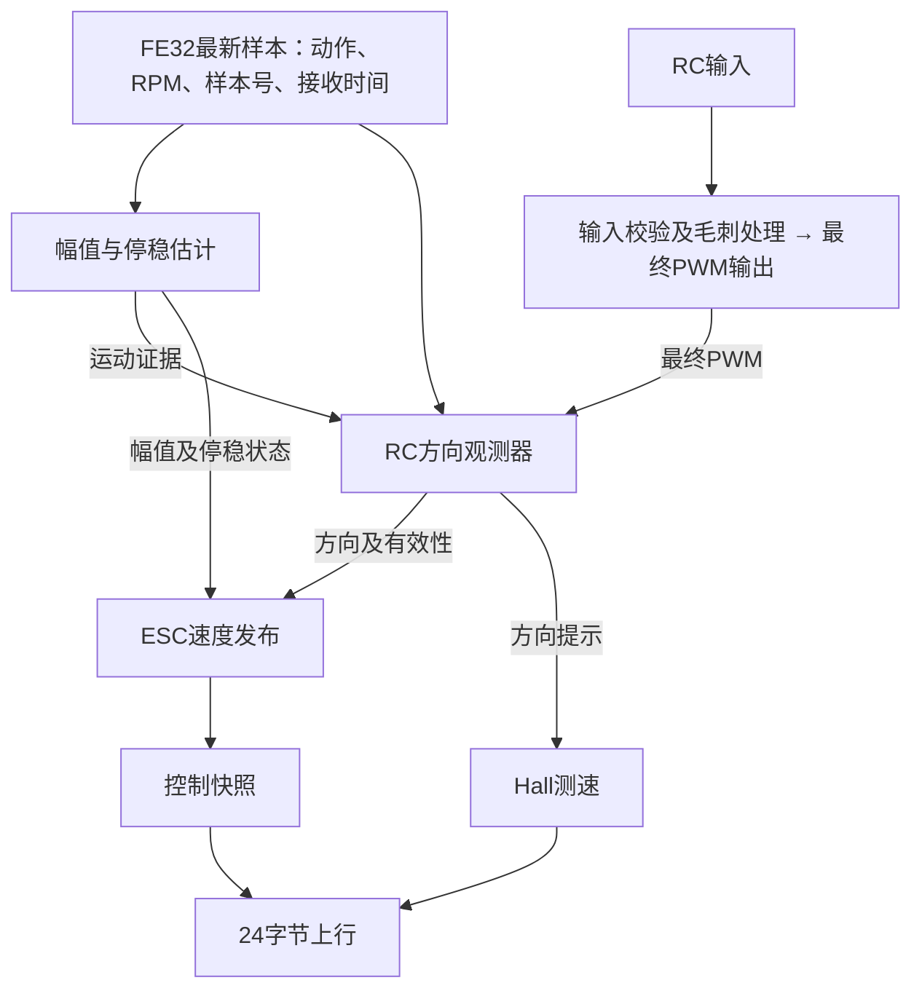
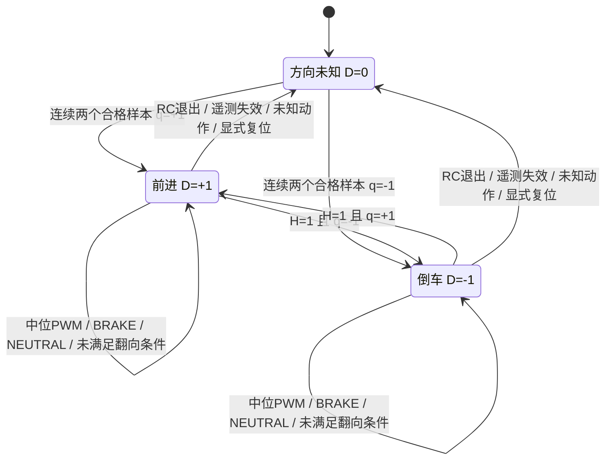
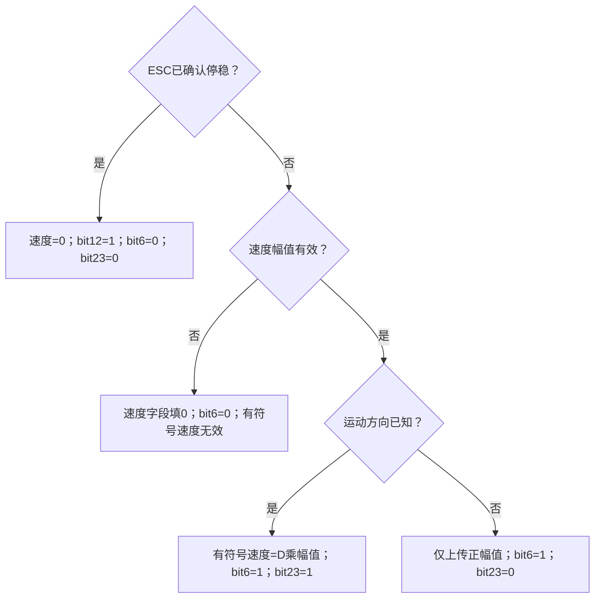

# RC运动方向观测与速度发布设计说明

## 1. 范围与职责

本文定义当前固件在RC控制源生效时的运动方向观测、ESC有符号速度发布以及与AUTO的接口边界。模块总览见[ARCHITECTURE.md](ARCHITECTURE.md)，报文布局见[INTERFACES.md](INTERFACES.md)。

`RcDirectionObserver`根据ESC动作、最终输出PWM及历史状态推断运动方向。观测结果用于ESC速度符号和Hall方向提示，不参与RC输出仲裁，不生成推进、制动或回中命令。

约束如下：

- FE32的RPM字段为无符号幅值；动作字段不提供机械旋转方向。
- DRIVE表示驱动动作，前进与倒车均可报告该值；BRAKE表示制动动作；NEUTRAL不等价于机械停稳。
- RC方向来自软件推断。Hall不提供独立方向测量，两路速度同号不能作为方向正确性的独立证明。
- 本车PWM极性固定为高于中位对应前进侧、低于中位对应倒车/前进制动侧。观测器学习中位，不学习极性。
- 中位PWM不撤销已确认方向，也不单独构成换向证据。未建立方向时，中位PWM不能建立方向。

## 2. 数据流与执行时序

### 2.1 RC数据流



图中不存在观测器到PWM输出的控制路径。ESC动作颜色由最新FE32动作独立生成，不由速度符号或PWM侧推导。

### 2.2 周期与样本消费

| 环节 | 当前机制 | 数据语义 |
| --- | --- | --- |
| PD15接收 | EXTI/TIM5逐字节采样 | 字节及接收时间进入缓冲 |
| FE32解析任务 | 每轮处理后延时2ms | 解析合法帧；逐帧覆盖同一最新样本快照 |
| 控制任务 | 20ms周期 | 读取最新样本，更新幅值、输出PWM、更新RC方向并发布快照 |
| 状态上行任务 | 50ms周期 | 从控制快照取ESC结果，另取Hall快照，组装24字节报文 |

ESC发送周期由电调决定；已有实测为空闲约100ms、运行约20ms。接收时间使用MCU本地时基，不是ESC内部采样时间。

一次RC控制周期的执行顺序为：

1. 读取最新FE32快照，更新幅值及停稳估计。
2. 更新RC输入和控制源仲裁。
3. 写入本周期RC直通PWM。
4. 将步骤1的FE32与步骤3的最终PWM传入方向观测器。
5. 更新Hall方向提示，发布控制快照。

当前实现没有FE32逐帧消费队列，也没有按ESC采样时刻匹配PWM历史。两次控制调用之间若发布了多份FE32，观测器只看到最新一份。重复读取同一`sample_id`不重复执行样本状态转移。序号跳跃不补算丢失的动作。

因此，完整接收解析不等于高层逐帧消费；50ms上行动作不构成完整事件日志。缺少某种颜色不能证明电调从未报告过该动作。本次中位连续性修复不改变上述调度机制。

## 3. 输入、状态与输出定义

### 3.1 输入

| 符号 | 实现字段 | 定义 |
| --- | --- | --- |
| A | `rc_active` | RC控制源当前是否生效 |
| F | `telemetry_fresh` | 集成层确认接收样本存在、未失效且在新鲜度期限内 |
| I | `sample_id` | 合法FE32样本标识；与最后处理标识不同时视为新样本 |
| S | `state_raw` | 0=NEUTRAL、1=DRIVE、2=BRAKE；其他值为未知动作 |
| R | `rpm_raw`、`rpm_valid` | RPM幅值及字段有效性；用于中位学习 |
| M | `moving_evidence` | 同一FE32样本对应的运动估计是否报告运动 |
| P | `applied_pwm_us` | 本周期已写入的最终ESC脉宽，单位µs |

默认新鲜度期限为250ms。M由运动估计器生成，正常配置下速度幅值大于0.05m/s时为1；M=0也可能由RPM或换算不可用引起，不能单独解释为停稳。停稳确认另需不同的新鲜低速样本及时间覆盖，默认至少3份、覆盖150ms。

### 3.2 持久状态

| 符号 | 实现字段 | 含义 |
| --- | --- | --- |
| D | `direction` | 已确认方向：0=未知、+1=前进、-1=倒车 |
| K | `output_direction_known` | 观测器对外方向有效标志；不是报文bit23的无条件直拷贝 |
| N、L | `neutral_pwm_us`、`neutral_learned` | 学习中位及是否已建立 |
| H | `saw_non_drive_since_confirmed` | 允许后续相反侧DRIVE重新判向的过渡证据 |
| C、n | `pending_direction`、`pending_count` | 初次方向确认的候选及连续样本计数 |
| I_last | `last_sample_id`、`has_last_sample` | 最后处理样本及其有效标志 |

H不等于电调倒车许可，也不等于停稳证明。H既可由BRAKE/NEUTRAL设置，也可由已知方向下“相反PWM侧且M=0”的DRIVE样本设置。

PWM候选方向定义为：

```text
q = +1，P > N
q = -1，P < N
q =  0，P = N
```

### 3.3 输出

`direction_known=K`；K=1时`direction=D`，否则输出方向为0。`reason`记录本次处理原因，不是故障锁存标志。特别是`PWM_AT_NEUTRAL`可与有效方向同时存在。

`processed_new_sample`区分是否处理了新样本；`awaiting_non_drive_before_reversal`在D已知且H=0时置位。学习中位通过`neutral_learned`及`neutral_pwm_us`暴露。

## 4. 中位学习

只有F=1的新NEUTRAL样本进入学习分支。候选条件为`rpm_valid=1`、`rpm_raw=0`、P非零。

1. 连续两个不同样本的P必须为同一整数脉宽；否则重新开始配对。
2. 合格配对产生一个中位候选，配对计数回到1，允许连续合格样本形成重叠配对。
3. 保存最近最多5个候选，排序后取索引`count / 2`的值作为N，置L=1。
4. 非NEUTRAL、无效学习输入或方向复位会清除未完成的配对。

完整初始化清除全部中位数据。`ResetDirection`以及失效处理保留已学中位及候选窗口。中位不写入Flash。

## 5. 方向状态转移

### 5.1 入口判定优先级

下表按顺序匹配；命中前一项后不执行后续样本分支。

| 顺序 | 条件 | 状态处理 |
| --- | --- | --- |
| 1 | 输入指针无效 | 返回无效参数结果，不执行正常转移 |
| 2 | A=0 | 清D、K、H及初次确认；清中位配对和样本有效标志 |
| 3 | F=0 | 同上；原因记为遥测陈旧 |
| 4 | I等于有效的I_last | 返回当前状态，不重复累计确认或过渡证据 |
| 5 | 新样本 | 更新I_last，按S执行下列分支 |

新NEUTRAL样本执行中位学习并清初次确认；新BRAKE样本清中位配对和初次确认。两者在D已知时均保持D并置K=1、H=1；D未知时不能建立方向。

新样本的S为其他值时，清D、K、H、初次确认及中位配对，原因记为未知动作。已学习中位保留。

### 5.2 DRIVE分支

每份新DRIVE先清中位学习配对，再按表中优先级执行。`清初次确认`表示C=0、n=0。

| 顺序 | 条件 | D、K处理 | H处理 | 初次确认处理 |
| --- | --- | --- | --- | --- |
| 1 | L=0 | D保留，K=0 | 保留 | 清初次确认 |
| 2 | q=0 | D保留；K=(D≠0) | 保留 | 清初次确认 |
| 3 | M=0 | D保留；K=(D≠0) | D已知且q≠D时置1，否则保留 | 清初次确认 |
| 4 | D已知，q≠D，H=0 | 保持D，K=1 | 保留0 | 清初次确认 |
| 5 | D已知，q≠D，H=1 | D=q，K=1 | 清0 | 清初次确认 |
| 6 | D已知，q=D | 保持D，K=1 | 清0 | 清初次确认 |
| 7 | D未知，C≠q | D保持未知，K=0 | 保留 | C=q，n=1 |
| 8 | D未知，C=q | n增加至2后D=q、K=1 | 确认时清0 | 累计不同样本 |

第2项为本次修复：PWM恰好等于中位时保留已确认方向。该分支既不产生换向证据，也不消耗已有过渡证据；不冻结速度幅值。第3至8项的转移条件未改变。

### 5.3 方向状态图

图中F/R仅表示D的值；H、候选计数和入口有效性按前述表执行。所有确认与换向箭头均要求A=1、F=1、新DRIVE样本、L=1且M=1。



### 5.4 典型输入序列

以下各行均为不同的新鲜样本，中位已学习，初始方向已经确认。

| 序列 | 输入条件 | 方向结果 |
| --- | --- | --- |
| 前进收油 | D=+1；DRIVE、q=0 → NEUTRAL、RPM非零 | 全程保持+1，幅值跟随RPM |
| 倒车收油 | D=-1；DRIVE、q=0 → NEUTRAL、RPM非零 | 全程保持-1，幅值跟随RPM |
| 前进制动起点 | D=+1、H=0；DRIVE、q=-1、M=1 → BRAKE | 先保持+1，再记录H=1；制动输入不直接翻向 |
| 前进转倒车 | D=+1；BRAKE → NEUTRAL → DRIVE、q=-1、M=1 | 在最后一份样本改为-1 |
| 倒车转前进 | D=-1；BRAKE → DRIVE、q=+1、M=1 | 在最后一份样本改为+1，不要求再次回中 |
| 过渡后经过中位 | D已知、H=1；DRIVE、q=0 → 相反侧DRIVE、M=1 | 中位保持D和H，后一份按已有条件翻向 |

电调负责前进转倒车所需的刹车阈值与许可。RC观测器不计算该阈值。相反侧输入若持续报告BRAKE，观测器保持原方向。

## 6. 速度计算与发布

### 6.1 幅值、方向与停稳

低档当前换算为：

```text
wheel_rpm = rpm_raw × 0.14115
speed_magnitude_mps = wheel_rpm × 2π × wheel_radius_m / 60
wheel_radius_m = 0.115（当前配置）
signed_speed_mps = D × speed_magnitude_mps（仅方向与幅值均有效时）
```

传动系数到轮轴为止，轮胎半径独立配置。RPM无效、换算无效或样本陈旧使幅值不可用；方向观测器保留内部D不能覆盖这些无效条件。RPM无效本身不是观测器中独立的清D分支。

连续性约束为：在幅值有效、未确认停稳且已有确认方向的区间，PWM经过中位不单独使有符号速度无效。使用最新已处理样本的幅值，样本间沿用该值并保留原接收时间；不进行插值、外推或延长新鲜度期限。

### 6.2 24字节出口

表中bit6、bit12、bit23属于`status_bits`。上行任务对已确认停稳优先处理。

| 发布条件 | 字节7–8（mm/s） | bit6幅值有效 | bit23方向已知 | bit12停稳 |
| --- | --- | --- | --- | --- |
| 未停稳，幅值有效，方向已知 | 有符号速度 | 1 | 1 | 0 |
| 未停稳，幅值有效，方向未知 | 正幅值 | 1 | 0 | 0 |
| 已确认停稳 | 0 | 0 | 0 | 1 |
| 未停稳，幅值无效 | 0占位 | 0 | 取决于方向状态，不可单独使用 | 0 |

Dashboard在bit12=1时显示零；否则仅在bit6和bit23均为1时显示有符号速度。其他情况有符号速度为无效值，不能将其替换为零。字节1高两位独立编码动作：`00 UNKNOWN / 01 NEUTRAL / 10 DRIVE / 11 BRAKE`。



### 6.3 Hall接口

RC下，方向已知且ESC未确认停稳时，向Hall模块传递D；否则传递0。Hall独立计算周期速度和有效性，换向后重新建立脉冲周期。当前`HallSpeed_SetCommandDirection(0)`不立即删除旧符号，不能推导“ESC方向未知则Hall立即无效”。

## 7. RC与AUTO边界

| 项目 | RC | AUTO |
| --- | --- | --- |
| FE32接收、幅值及停稳估计 | 共用接收链和运动估计器 | 同左 |
| PWM生成 | 接收机输入经校验、毛刺处理后直通 | 目标速度经纵向控制器与Mode2门控 |
| 方向状态 | `s_rc_direction_observer` | `s_mode2_drive_gate`与`s_vehicle_direction` |
| 有符号速度方向 | RC观测结果 | AUTO保存的方向；内部控制方向还由门控状态推导 |
| 方向与执行器关系 | 观测结果不回写RC PWM | 控制方向参与速度误差和换向判定 |
| FE32动作用途 | 按第5节确认及保持方向 | 授权检查、R→F换向分支的BRAKE→DRIVE识别 |

RC不写AUTO方向。进入或退出RC使AUTO执行历史失效；RC期间复位纵向控制器，退出RC清RC方向并保留学习中位。控制权切换不复位电调内部许可。

没有新鲜串口命令且RC输入可用时直接启用RC；串口有效时，人工接管需满足阈值和确认条件。从AUTO人工接管后，归中保持默认500ms才释放；未触发人工接管的普通RC直通，可在串口有效且已归中时立即释放。

AUTO方向状态独立于本文观测器。当前F→R仍依据实际PWM制动资格、停稳和回中驻留；R→F仅在对应换向分支先观察到BRAKE、后观察到DRIVE时撤销完整制动请求。该机制不构成全局方向纠错保证。本文RC修复不改变AUTO实现。

## 8. 观测能力边界与验收依据

本实现存在以下观测边界：

- 缺少独立方向传感器；外力反向、ESC状态滞后及跨采样换向不能仅凭RPM幅值判定。
- NEUTRAL/BRAKE或M=0产生的H不是停稳证明。满足H与相反侧DRIVE即允许翻向，未引入额外换向确认时间。
- 高层使用最新样本快照，短动作可能被覆盖。当前不承诺完整处理每份FE32。
- 当前PWM与FE32接收时间没有历史配对。中位保持修复消除一个错误失效分支，不证明其他时序组合全部正确。
- 真正失去速度或方向依据时仍输出无效语义；连续性要求不覆盖遥测失效。

修复前记录`c63a-2026-09-22T03-41-54-409Z.csv`中，9–25s内以下区间存在方向位清零而幅值有效的情况。用户确认其余显示区间的方向符合实车操作。

| 时间区间（s） | 动作 | 幅值（m/s） | bit23 |
| --- | --- | --- | --- |
| 11.603–11.654 | DRIVE | 1.113 | 0 |
| 11.954–12.103 | DRIVE | 0.882–0.894 | 0 |
| 18.253–18.403 | DRIVE | 1.228–1.237 | 0 |
| 20.103–20.253 | DRIVE | 0.132–0.135 | 0 |

旧版中位PWM分支会产生这种失效。CSV不含实际PWM、学习中位或观测器原因码，因此不作为各区间实际分支的直接证明。

实车验收覆盖前进收油、前进制动、倒车收油及倒车持续正向输入转前进。要求原有正确方向与RC操控行为保持，反馈有效且方向已建立时不因经过中位产生空白。软件检查仅验证给定输入下的实现行为；修复前记录不能替代新固件的实车验收。

## 9. 实现索引

| 职责 | 实现入口 |
| --- | --- |
| 输入、状态和原因码 | [rc_direction_observer.h](../WHEELTEC_APP/Inc/rc_direction_observer.h) |
| 中位学习、DRIVE转移及失效处理 | [rc_direction_observer.c](../WHEELTEC_APP/rc_direction_observer.c)：`rc_direction_observe_neutral`、`rc_direction_observe_drive`、`RcDirectionObserver_Update` |
| 接收调度 | [esc_telemetry_stm32.c](../WHEELTEC_APP/esc_telemetry_stm32.c)：`EscTelemetryTask` |
| 样本发布与快照读取 | [esc_telemetry.c](../WHEELTEC_APP/esc_telemetry.c)：`esc_telemetry_publish_sample`、`EscTelemetry_GetSnapshot` |
| 集成时序与速度出口 | [servo_basic_control.c](../WHEELTEC_APP/servo_basic_control.c)：`ServoBasic_ProcessControl`、`servo_basic_update_rc_direction_observer`、`servo_basic_collect_esc_uplink_speed` |
| RPM换算与停稳 | [esc_motion_estimator.c](../WHEELTEC_APP/esc_motion_estimator.c)：`EscMotionEstimator_ObserveSample`、`EscMotionEstimator_GetEstimate` |
| 上行有效性与字段编码 | [data_task.c](../WHEELTEC_APP/data_task.c)：`RobotDataTransmitTask` |
| 默认配置 | [app_vehicle_config.h](../WHEELTEC_APP/Inc/app_vehicle_config.h) |
| 既有软件检查 | [观测器单测](../tests/host/test_rc_direction_observer.c)、[控制集成测试](../tests/host/test_servo_basic_control.c) |
