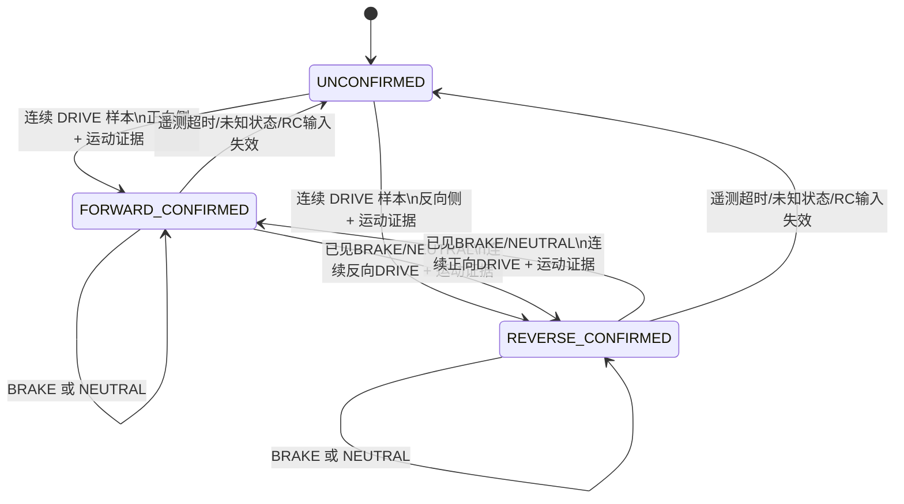

# RC 方向观测器

本文定义并记录 **RC遥控器直通控制** 时Hall速度和ESC速度的方向判定实现。串口自动控制、纵向闭环和`mode2_drive_gate`使用独立状态，不经过本观测器。

## 1. 行为边界

RC控制下满足以下规则：

- 前进时，Hall 和 ESC 速度均为正；
- 倒车时，Hall 和 ESC 速度均为负；
- 前进刹车和前进滑行时，在车轮仍向前运动期间，两路速度继续保持正号；
- 倒车刹车和倒车滑行时，在车轮仍向后运动期间，两路速度继续保持负号；
- 停稳时两路速度回到零；
- 电调动作状态、遥测新鲜度或方向证据不足时，不伪造有符号速度；
- RC 油门仍按当前合法性和毛刺过滤后直通，方向观测器不改变输出 PWM。

本观测器不生成刹车、回中或推进动作，也不修改串口目标速度闭环、自动路径前馈、PI或制动力映射。

## 2. 已确认事实

### 2.1 FE32 字段

电调编程口 FE32 帧中的 RPM 是无符号幅值。2026-09-18 的独立 USB-TTL 记录中，前进和后退各 250 帧的 byte 11 均为 `1`，所以 byte 11 不是方向位。

结合直接采集和动态循环记录，byte 11 的动作语义为：

| `state_raw` | 动作语义 | 能否单独给出方向 |
| --- | --- | --- |
| 0 | NEUTRAL，中位／无驱动输出 | 不能 |
| 1 | DRIVE，电调正在驱动 | 不能；前进和倒车均为 1 |
| 2 | BRAKE，电调正在制动 | 不能；刹车输入侧不能代表车辆运动方向 |
| 其他 | UNKNOWN | 不能 |

动态循环记录中，`state_raw=2` 时 `throttle_output_raw` 恒为 0，RPM 从非零衰减到零，符合制动动作。`state_raw=0` 时也可能短暂存在非零 RPM，说明中位滑行不能等同于停稳。

证据：

- `../资料/实测记录/2026-09-18_ESC方向验证/`
- `../资料/实测记录/2026-09-15_UART_前进刹车后退_01/decoded.csv`
- `../资料/实测记录/2026-09-15_UART_前进刹车后退_02/decoded.csv`

### 2.2 实车模式二行为

实车行为是非对称的：

- 上电后的电调默认处于前进许可状态；
- 前进转倒车：负向输入先被解释为刹车，达到电调所需条件并回中后，再次负向输入才成为倒车；
- 倒车转前进：正向输入先制动；停下后继续保持正向输入，电调会直接进入前进，无需再次回中和第二次输入；
- 因此，不能用一套“刹车—停稳—回中—第二次输入”的对称软件状态机推断两个方向。

### 2.3 被替换的旧实现

旧版`servo_basic_control.c`的`rc_hall_mode2_update()`存在以下问题：

- 把两个方向都按对称模式二处理；
- 在认为输入属于刹车或等待回中期间，把 Hall 命令方向设为 0；
- RC接管生效时，每个控制周期都会调用`servo_basic_clear_vehicle_direction()`，所以供ESC速度使用的`s_vehicle_direction`持续为未知。

当前实现已经删除这套RC对称状态机和RC周期清方向逻辑。

这解释了 2026-09-21 曲线中的两个现象：

- 用户确认的倒车区间 18–21 s、26–29 s，Hall 为负数且方向正确；
- 前进区间 Hall 没有输出，ESC 仍只有正幅值而没有可信方向。

最新 RC 记录：

- `../资料/实测记录/2026-09-21_RC模式二方向序列_02/`

## 3. 核心决策

RC 方向不再由“遥控器输入历史”预测，而由 **电调实际动作状态 + 已实际输出的 PWM 所在侧 + 新鲜转速证据**确认。

规则只有四条：

1. `DRIVE` 是唯一允许确认或改变车辆方向的动作状态。
2. `BRAKE` 保留最后一次已确认的运动方向，绝不翻转方向。
3. `NEUTRAL` 保留最后一次已确认的运动方向，允许正确表示滑行；它本身不确认新方向。
4. `UNKNOWN`、遥测超时或 RC 输入失效使对外方向变为未知，不根据命令猜测。

从一个已确认方向切换到相反方向还有一个时序条件：自上次确认 DRIVE 后，必须至少观察到一份新的 `BRAKE` 或 `NEUTRAL` 样本。这样，PWM刚换边时残留的一两份旧 DRIVE 遥测不会直接翻转物理方向。F→R会经过BRAKE和NEUTRAL，R→F会经过BRAKE，因此这个条件不强迫两边使用相同的回中流程。

这不是把 byte 11 当方向位。byte 11 只回答“电调此刻是在驱动、制动还是中位”；方向由 `DRIVE` 时实际 PWM 所在的一侧决定。

## 4. 不再用固定 1500 µs 判定电调状态

`1500 µs` 仍可作为当前输出配置中的中位命令值，但不能继续承担“电调已经在驱动／制动／换向”的判定职责。

RC 方向观测器在每次上电后从电调明确报告的 `NEUTRAL` 样本学习实际中位：

1. 只处理 CRC 正确、新鲜、样本号递增的 FE32 帧；
2. 只在 `state_raw=0`、RPM 有效且为零时采集中位候选；
3. 要求输出 PWM 在连续两个不同 FE32 样本间为同一整数脉宽，排除动作切换时的滞后帧；
4. 第一组合格的连续样本建立中位，随后使用最近 5 个合格候选的中位数更新 `neutral_pwm_us`；不写入 Flash；
5. 中位尚未建立时，方向保持未知。

在 `DRIVE` 状态下：

- 实际输出 PWM 高于学习中位：候选方向为前进；
- 实际输出 PWM 低于学习中位：候选方向为倒车；
- 实际输出 PWM 等于学习中位或与状态相互矛盾：本帧不能确认方向。

当前车辆的 PWM 极性已经由实车控制确认：高于中位为前进侧，低于中位为倒车／前进制动侧。若以后反转电调输入极性，应修改明确的车辆极性配置，不能让观测器自动猜测极性。

## 5. 状态机

方向状态只保留三个值：

| 状态 | 含义 |
| --- | --- |
| `UNCONFIRMED` | 当前没有足够证据输出有符号速度 |
| `FORWARD_CONFIRMED` | 最近一次由新鲜 DRIVE + 正向 PWM 侧 + 运动证据确认前进 |
| `REVERSE_CONFIRMED` | 最近一次由新鲜 DRIVE + 反向 PWM 侧 + 运动证据确认倒车 |

`BRAKE`、`NEUTRAL`、`DRIVE` 是每份 FE32 样本携带的动作，不再复制成一套软件预测阶段。



### 5.1 DRIVE 确认条件

一次方向确认必须同时满足：

- RC 控制权当前生效；
- FE32 样本新鲜、CRC 正确、`state_raw=1`；
- 已经学到中位；
- 实际输出 PWM 明确处于中位的一侧；
- ESC RPM 有效且高于现有停稳阈值；
- 连续两个不同 FE32 样本得到相同候选方向。

如果候选方向与当前已确认方向相反，还必须在两次确认之间见过新的BRAKE或NEUTRAL样本；同方向DRIVE不需要这个条件。

连续两帧用于隔离“PWM 已经换边、但收到的仍是切换前一帧电调状态”的时序差。只重复读取同一个样本不能增加确认计数。油门幅度可以变化，只要求两帧位于中位同一侧。

### 5.2 BRAKE 与 NEUTRAL

| 当前已确认方向 | ESC 动作 | 输出方向 |
| --- | --- | --- |
| 前进 | BRAKE | 前进，直到停稳；不能因负向刹车输入变成倒车 |
| 倒车 | BRAKE | 倒车，直到停稳；不能因正向刹车输入变成前进 |
| 前进 | NEUTRAL | 前进，覆盖前进滑行 |
| 倒车 | NEUTRAL | 倒车，覆盖倒车滑行 |
| 未确认 | BRAKE / NEUTRAL | 未知 |

停稳后速度数值为 0，内部可以保留最后确认方向；方向符号只在非零速度上有实际意义。

### 5.3 遥测失效

- 控制循环重复看到同一个新鲜样本时，保持现状，不重复推进状态机；
- 超过现有 FE32 新鲜超时后，对外 `direction_known=0`，Hall 有符号速度无效；
- 未知 byte 11 值同样使对外方向无效；
- 恢复接收后，必须重新取得连续 DRIVE + 运动证据才能恢复方向可信；
- 方向观测失效不修改 RC 直通 PWM，也不锁死接收器。

## 6. 实车动作序列

### 6.1 上电后直接前进

```text
NEUTRAL + RPM=0：学习中位，方向未知
正向输入，DRIVE + RPM>阈值：候选前进
下一份新 DRIVE 样本仍为正向侧：确认前进
Hall 与 ESC 均输出正速度
```

### 6.2 前进刹车后倒车

```text
前进 DRIVE：方向=前进
负向输入，BRAKE：方向仍=前进，速度随车辆减小
停稳：两路速度=0
回中，NEUTRAL：方向记忆不变
再次负向输入；只有电调实际报告 DRIVE 且出现转速后：候选倒车
连续第二份证据：方向=倒车，两路速度为负
```

如果第一次负向输入没有达到电调的倒车许可条件，后续负向输入仍只会得到 `BRAKE`，状态机不会把它误判为倒车。

### 6.3 倒车刹车后持续输入前进

```text
倒车 DRIVE：方向=倒车
持续正向输入，BRAKE：方向仍=倒车，速度随车辆减小
电调停稳后在同一正向输入下转为 DRIVE：产生前进候选
连续第二份 DRIVE + 运动证据：方向=前进
```

软件不要求回中，也不要求第二次正向输入；是否已经从刹车切换到前进，以电调报告的 `BRAKE → DRIVE` 为准。

## 7. 两路速度的统一规则

幅值来源不变：

- ESC：`rpm_raw × 0.14115` 得到轮轴 RPM，再结合轮胎半径得到速度幅值；
- Hall：相邻 HallB 有效脉冲周期得到轮速幅值。

方向来源统一为当前 RC 方向观测器：

```text
ESC有符号速度  = ESC速度幅值  × confirmed_direction
Hall有符号速度 = Hall速度幅值 × confirmed_direction
```

不再允许 Hall 和 ESC 各自维护一套方向历史。方向改变时，Hall 周期历史按现有机制失效，等待新方向的脉冲对，避免把换向前的周期带到换向后。

对外协议保持 24 字节布局：

- 字节 3–6 仍是 Hall 有符号速度；
- 字节 7–8 仍是 ESC 速度；
- `status_bits.bit23` 仍表示车辆方向可信；
- 方向未知时，ESC 字段仍可上传正的速度幅值且 bit 23 清零；Hall 字段填 0，并清除 Hall 有符号速度有效位。

## 8. 代码边界

实现由一个纯状态模块组成：

- `WHEELTEC_APP/Inc/rc_direction_observer.h`
- `WHEELTEC_APP/rc_direction_observer.c`
- `tests/host/test_rc_direction_observer.c`

模块只接收值并返回观测结果，不读取 HAL、GPIO、FreeRTOS 或全局控制变量。`servo_basic_control.c` 负责把下列数据组装成输入：

- 当前是否为 RC 控制；
- 新鲜 FE32 的 `sample_id`、`state_raw`、RPM 有效性和 RPM；
- 已实际写入 ESC 的最终 PWM；
- 当前时间与遥测新鲜度。

旧的`rc_hall_mode2_phase_t`、`s_rc_hall_direction`、`s_rc_hall_pending_direction`、`rc_hall_mode2_reset()`和`rc_hall_mode2_update()`已经删除。

自动控制的`Mode2DriveGate_t`、`LongitudinalController_t`和相关状态保持独立。最终方向选择按控制源隔离：

```text
RC 生效   -> RC direction observer
AUTO 生效 -> AUTO direction source
无控制源  -> direction unknown
```

## 9. 回归覆盖

### 9.1 主机单元测试

主机测试覆盖：

1. NEUTRAL 零转速样本建立中位；
2. 前进 DRIVE 两个新样本确认正向；
3. 前进 BRAKE 期间保持正向；
4. 前进 NEUTRAL 滑行保持正向；
5. F→R 的第一次负向 BRAKE 不翻转；
6. 回中后负向 DRIVE 两个新样本确认倒车；
7. 倒车 BRAKE 期间保持负向；
8. R→F 持续正向输入在 `BRAKE → DRIVE` 后确认前进，不要求回中；
9. 未达到 F→R 阈值时反复出现 BRAKE，永不误判倒车；
10. PWM 刚换边时的一份滞后 DRIVE 样本不能单独翻转方向；
11. 未观察到BRAKE或NEUTRAL时，连续的相反侧DRIVE样本也不能直接翻转已确认方向；
12. 重复样本号不能增加确认计数；
13. 遥测超时、未知状态或 RC 输入失效使方向无效；
14. 方向未知时 Hall 不上传伪造符号，ESC 只上传无符号幅值；
15. RC 观测器不改变任何输出 PWM。

### 9.2 实车记录序列

轮子架空，按以下固定顺序录制一段短数据：

```text
静止
前进
回中滑行并停稳
前进
持续负向刹车
回中
倒车
持续正向刹车直到自动进入前进
回中并停稳
```

验收时同时保存：最终 ESC PWM、FE32 `state_raw`、raw RPM、Hall 速度、ESC 速度、方向可信位和样本号。判定以实物运动方向为准，不能只看命令方向。

## 10. 实现与验证

- 旧RC对称方向状态机已经删除；
- 独立观测器和`servo_basic_control`集成回归均已加入主机测试；
- ARM GCC固件构建、向量表验收和静态接口验收通过；
- Keil工程已包含`rc_direction_observer.c`；
- 24字节上行布局保持不变；
- 串口自动控制继续走原有独立路径。

刷入固件后的短记录按9.2顺序进行，用于确认本车FE32动作切换时序和曲线显示与实现一致。
