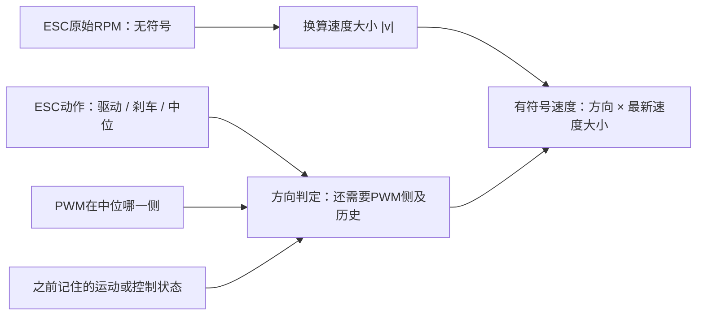
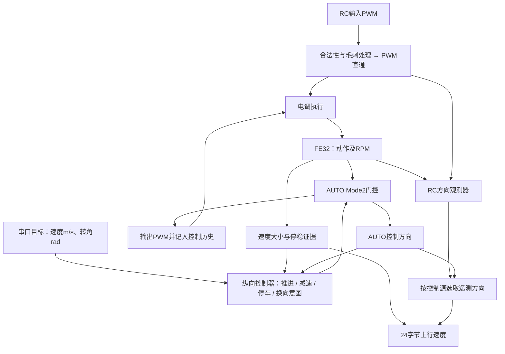
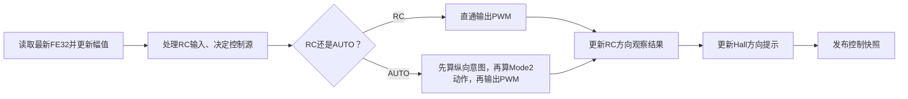
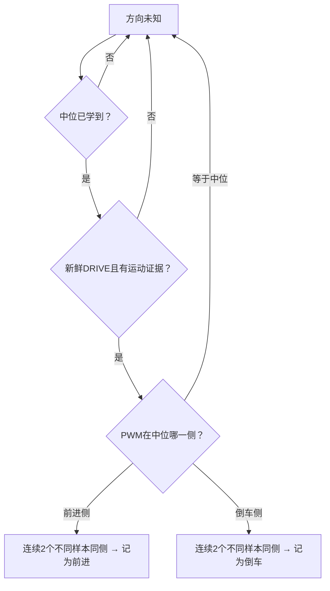
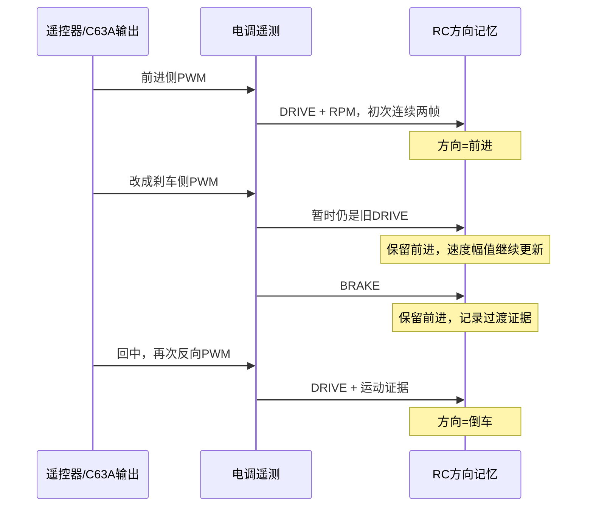
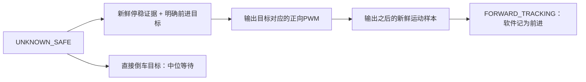
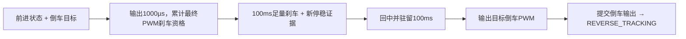
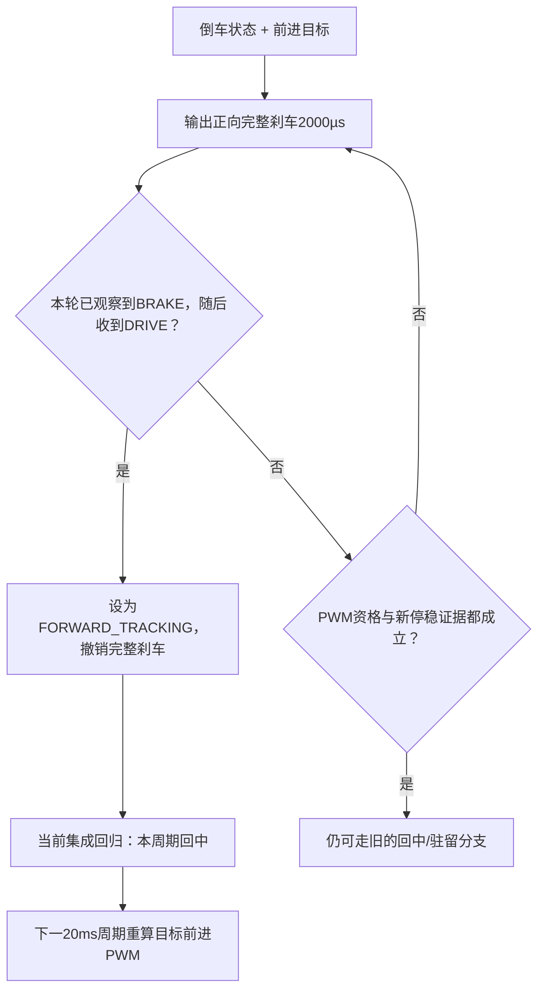
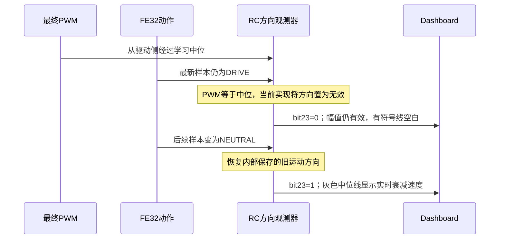

# 前进、倒车与刹车：RC和串口如何判断

本文说明当前固件的实际判定过程。先回答“怎么知道正在前进还是倒车”，再说明两个控制模式的区别、反馈含义和纠错边界。[ARCHITECTURE.md](ARCHITECTURE.md)负责模块总览，[INTERFACES.md](INTERFACES.md)负责字节定义。

## 1. 电调没有直接告诉我们前进还是倒车

电调给出两个关键观测：

| 电调报告 | 可以知道什么 | 不能知道什么 |
| --- | --- | --- |
| RPM，例如300 | 转速大小 | 正转还是反转 |
| DRIVE | 电调处于驱动动作 | 前进驱动还是倒车驱动 |
| BRAKE | 电调处于刹车动作 | 车轮还在向前还是向后转 |
| NEUTRAL | 电调处于中位动作 | 车轮是否已经停下 |

FE32的原始动作字节为`0=NEUTRAL、1=DRIVE、2=BRAKE`。前进和倒车实测都报告DRIVE。动作是接收到的电调状态，存在采集、传输和任务处理延迟，不能当作与当前PWM完全同时发生的确认信号。

**速度的大小来自RPM；速度的正负号来自软件推断。** 霍尔当前也只负责计速，不提供独立的方向验证。

速度大小计算：`wheel_rpm = rpm_raw × 0.14115`，`|v| = wheel_rpm × 2π × 0.115 / 60`。传动系数到轮轴为止，轮胎半径单独参与换算。

## 2. RC和串口不是同一个状态机

两者使用相同的FE32解析、RPM换算和停稳估计，但方向判定和执行职责不同。

| 问题 | RC遥控器经过C63A | 串口AUTO |
| --- | --- | --- |
| 谁决定油门/刹车输入？ | 人操作遥控器 | 纵向控制器与Mode2门控 |
| C63A是否计算目标速度PWM？ | 否，处理合法性/毛刺后直通 | 是，目标速度经前馈、PI和门控变为PWM |
| 谁记住前后方向？ | `RcDirectionObserver`运动方向 | Mode2控制状态与`s_vehicle_direction` |
| ESC动作参与哪里？ | 初次方向确认、刹车/滑行保持、换向观察 | 自动授权检查及R→F换向的BRAKE→DRIVE分支 |
| 输出有符号速度的方向来源 | RC观测结果 | AUTO控制状态推定方向 |
| 观测方向会不会改变油门？ | 不会 | AUTO控制方向会影响闭环和换向 |
| 是否每帧由ESC重新核实所有状态？ | 否 | 否 |

RC观测器不写AUTO的`s_vehicle_direction`。但AUTO内部方向同时服务控制和遥测；不能把“RC显示方向与控制解耦”理解成“整个系统所有方向都与控制无关”。

### 2.1 共用什么、各自维护什么？

| 代码中的数据/对象 | 谁维护、谁使用 | 切换控制源时怎样处理 |
| --- | --- | --- |
| `s_esc_latest_raw_sample`、接收epoch、样本号 | 同一个FE32接收链；RC/AUTO共用动作和RPM | 继续接收，不因为接管而停采 |
| `s_esc_motion_estimator`、`s_esc_motion_estimate` | 共用速度幅值及停稳估计 | 清除旧动作下的停稳证据，重新累计；不是两份独立估计器 |
| `s_rc_direction_observer` | RC专用：学习中位、方向记忆、过渡证据、初次确认计数 | 退出RC清方向，保留学习中位；重新进入后不直接继承AUTO方向 |
| `s_rc_direction_result` | RC观测输出；遥测和Hall方向提示读取 | 退出RC清除 |
| `s_mode2_drive_gate` | AUTO专用：推进、连续刹车、回中、许可与恢复状态 | 进入或退出RC都使AUTO执行历史失效 |
| `s_vehicle_direction`及`known` | 名字虽然叫vehicle，当前写入来自AUTO提交动作 | RC不写它；退出RC清除；AUTO控制方向回退和非RC遥测使用它 |
| `s_longitudinal_controller` | AUTO专用：目标斜坡、前馈、PI及跟踪刹车 | RC期间复位，不在后台继续积分 |
| `g_orin_state` | 保存串口目标、命令年龄、使能/刹车/软件停止请求 | RC接管期间非零串口目标替换为零，避免退出RC后恢复缓存运动 |
| `g_state.esc_pulse_us`、转向PWM | 共用的最终输出记录，E/S由这里取值 | 当前取得控制权的源写入 |
| Hall周期、累计计数与有效性 | 独立采集；符号由当前控制源提示 | 不是方向真值；清提示为0可能仍保留旧符号直到无脉冲超时 |
| 发布快照、24B编码 | 共用反馈出口 | 选择RC方向或AUTO方向，动作字段始终取FE32 |

### 2.2 控制权什么时候属于RC？

- 没有新鲜串口命令、有有效接收机输入时：进入RC直通，不要求先大幅拨动。
- 串口命令有效时：遥控器超过接管阈值并满足确认次数，取得RC控制权。
- 从AUTO被人接管后：遥控归中持续默认500ms才释放；普通无操作的RC直通遇到串口有效命令且已归中，可以立即释放。
- 没有可用源时：输出中位。界面模式名AUTO本身不表示自动推进已使能。
- 接管边界会清AUTO执行历史、PI及旧停稳证据。软件换控制权不会复位电调内部许可状态。

对应`update_control_mode_from_rc()`、`set_rc_override_state()`、`servo_basic_invalidate_auto_history()`与`SerialControlTask()`。

### 2.3 一个20ms控制周期的先后顺序

FE32是本周期开始时拿到的最新样本，RC方向判断使用本周期最终输出PWM。当前没有按FE32采样时刻查询历史PWM的配对机制；这正是“PWM已换边、FE32动作尚未更新”会出现的原因之一。50ms上行任务再读取快照打包，串口帧序号不是FE32样本号。

## 3. RC到底怎么知道方向？

### 3.1 先学习中位，再判断PWM所在侧

学习条件：新鲜NEUTRAL帧、RPM有效且为0、连续两个不同样本对应相同整数PWM。第一组合格样本建立中位，随后取最近最多5个候选的中位数。MCU重启重新学习；仅清方向时保留已学中位。

以学到的中位1500µs为例：

- 1600µs：前进侧。
- 1400µs：倒车/前进刹车侧。
- 1500µs：无法凭PWM侧判断方向。

这里的“前进侧”是本车既定极性。中位可以学习，但前后极性不会自动学习。输出脉宽也仍有单位µs，不能被FE32状态替代。

### 3.2 第一次运动：连续两帧确认

“有运动证据”是换算速度大小大于当前停稳阈值，默认0.05m/s。它只说明有转速，不是独立方向证据。重复读取同一FE32样本不增加确认次数。

例如：学到1500µs后，连续两帧都是DRIVE、PWM为1600µs、速度大小为0.3和0.4m/s，就记为前进，输出`+0.4m/s`。若同样条件下PWM为1400µs，则记为倒车，输出`-0.4m/s`。

### 3.3 已确认方向后：按以下顺序判断

内部记忆只有方向、初次确认计数和一个“曾见过过渡证据”的标志。过渡证据不是独立的物理方向测量，也不等于AUTO倒车许可。

| 收到的情况 | 当前实现做什么 |
| --- | --- |
| RC不再生效、遥测失效/陈旧、未知动作码 | 清除方向，恢复后重新确认 |
| 重复样本 | 保持现状 |
| BRAKE或NEUTRAL | 保持旧方向，记录过渡证据 |
| DRIVE、PWM等于学习中位 | 对外方向无效；内部旧方向仍保留 |
| DRIVE、没有运动证据 | 保持已有方向；若PWM与旧方向相反，记录过渡证据 |
| DRIVE、有运动、PWM与旧方向同侧 | 保持方向，清除过渡证据 |
| DRIVE、有运动、PWM与旧方向相反、没有过渡证据 | 保持旧方向，认为可能是刹车起点的状态滞后 |
| DRIVE、有运动、PWM与旧方向相反、有过渡证据 | 第一份这样的样本立即改成新方向 |

**当前RC换向不要求3帧/150ms停稳确认，也不要求换向再等两帧。** “没有运动证据”与“确认停稳”也不是一回事：前者来自`moving_observed=0`，可能是低速，也可能是RPM/换算配置不可用。观测器目前没有把这些原因完全区分开。

### 3.4 前进→刹车→倒车：每一步的速度符号

以下PWM仅为示例，速度数字用于解释流程。

| 步骤 | 最终PWM | 收到的ESC动作 | 最新速度大小 | 软件结果 |
| --- | --- | --- | --- | --- |
| 已确认前进 | 1600 | DRIVE | 1.5 | 前进，`+1.5` |
| 开始刹车，遥测还没跟上 | 1400 | 仍是DRIVE | 1.4 | 无过渡证据，保持前进，`+1.4` |
| 电调报告刹车 | 1400 | BRAKE | 0.8 | 保持前进，记录过渡证据，`+0.8` |
| 车轮停下 | 1400 | BRAKE | 0 | 速度0；方向记忆可以保留 |
| 人回中 | 1500 | NEUTRAL | 0 | 保留过渡证据 |
| 人再次反向，电调实际驱动 | 1400 | DRIVE | 0.3，超过运动阈值 | 改为倒车，`-0.3` |

RC观测器不判断人是否给够了倒车许可阈值。若电调仍报告BRAKE，软件就继续保留旧方向；实际是否允许倒车由电调处理。

### 3.5 倒车→刹车→前进：不用第二次拨动

已确认倒车时，正向侧PWM先刹车，BRAKE期间仍输出负速度。人持续保持正向侧输入，电调停下后进入DRIVE；观测器已记住BRAKE，因此第一份正向侧DRIVE且有运动证据的样本就将方向改为前进。

连续的是`最后确认方向 × 每帧最新RPM幅值`，不是冻结速度，也没有Dashboard插值。真正缺少方向证据时仍应承认未知；不能保证所有工况绝不断线。

## 4. 串口AUTO怎么判断方向？

串口下发的是目标速度，例如`-0.7m/s`，不是直接给PWM。目标负号表示“要求倒车”，不证明车辆已经倒车。

### 4.1 启动与首次前进

自动授权要求FE32动作不是UNKNOWN，但上述前进恢复确认本身主要检查动作之后的新鲜运动证据，并不要求动作必须是DRIVE。电调上电默认前进许可，与MCU启动时将软件状态设为未知，是两个不同概念。

### 4.2 AUTO前进→倒车

当前代码仍主要凭PWM输出历史、停稳和驻留建立倒车许可。提交倒车PWM后，软件进入倒车跟踪；**没有额外等待ESC报告倒车DRIVE来核实这次倒车已经成功。** FE32本身也不提供“倒车已解锁”位。

### 4.3 AUTO倒车→前进：新增动作反馈修正在哪生效？

这条BRAKE→DRIVE分支位于`mode2_evaluate_reversal_target()`，用于目标方向为前进的换向请求。**它不是每个AUTO状态都执行的全局纠错。**

尤其需要区分：

- 刚发出正向刹车但还没收到BRAKE时，代码也会输出2000µs。
- 若完整BRAKE过程在两份遥测之间发生，软件没有看到BRAKE，后续DRIVE不能触发这一快捷修正。
- 目标为零的停车走`mode2_evaluate_neutral_target()`，同向减速走跟踪刹车分支；它们没有同样的通用BRAKE→DRIVE修正。
- “立即撤销”是指收到并处理该反馈的控制周期，不能消除电调状态发生变化到反馈到达之前的延迟。

因此不能把当前实现表述为“任何情况下只要电调开始推进，完整刹车就必然已经撤销”。

## 5. 哪些数据来自ESC，哪些还依赖µs？

| 数据/状态 | 实际依据 |
| --- | --- |
| 串口目标速度/转角 | 上位机下发mm/s、mrad |
| RC输入与电调/舵机输出 | PWM脉宽，单位µs |
| ESC动作及Dashboard动作颜色 | 新鲜FE32动作字节 |
| ESC速度大小 | RPM及轮轴/轮胎换算，不来自PWM大小 |
| RC速度正负号 | FE32动作、最终PWM相对学习中位的位置、方向历史 |
| AUTO速度正负号 | Mode2控制方向及保存的AUTO方向 |
| AUTO前进/倒车许可 | PWM历史、停稳、驻留；R→F特定分支加入动作反馈 |
| 停稳 | 新鲜低速样本，默认≤0.05m/s、至少3帧、覆盖150ms |
| 回传转向角、OLED的S | PWM标定反算/输出值；无独立轮角测量 |
| OLED的M/Q、上行bit28/29 | 软件Mode2状态/原因，不等于ESC动作 |

“准确给出的状态”只能用于描述电调报告的动作类别，不能扩展为真实运动方向、倒车许可或机械停稳。

## 6. 误判后能不能及时修正？

**有条件能恢复，没有通用的立即自纠错保证。**

| 情况 | 当前恢复行为 | 现有边界 |
| --- | --- | --- |
| RC刹车起点PWM换边，FE32仍是旧DRIVE | 保持原方向，后续BRAKE继续保持 | 没有独立的保持时限；只受数据新鲜度及后续状态约束 |
| RC之前方向错了，收到过渡证据后又收到相反侧DRIVE | 第一份满足条件的运动样本改方向 | 若过渡证据一直没被观察到，旧方向可一直保留 |
| RC收到BRAKE/NEUTRAL后又来一份延迟的旧DRIVE | 可能按当前PWM侧切换 | 过渡标志不是停稳确认，也没有样本与历史PWM严格对时 |
| RPM字段无效 | 速度幅值无效，上行填0并清有效位 | RC方向记忆不保证同时清除；`moving_observed=0`可能被当作过渡证据 |
| RC遥测超时/未知动作/退出RC | 方向清除，恢复后首次DRIVE重新两帧确认 | 已学中位保留；PWM极性错误不能靠该过程自校正 |
| AUTO R→F确实收到BRAKE后收到DRIVE | 退出完整刹车，进入前进控制状态 | 限于换向分支；漏掉BRAKE时不保证修正 |
| AUTO F→R输出倒车后电调没有真的倒车 | 无通用动作反馈核验来纠正方向 | 软件许可与电调内部许可仍可能不一致 |
| AUTO动作UNKNOWN或反馈失效 | 自动授权撤销，门控回中并清历史 | 恢复后走未知状态恢复；不自动猜测倒车许可 |
| 外力推动车辆反向、两帧之间跨过零点 | 不具备独立方向检测能力 | ESC与Hall的符号一致不能证明物理方向正确 |

“RPM有更新”能验证测量还活着，“RPM变大”能验证确实在转，二者都不能独立证明前后方向。CRC正确也只证明传输内容通过校验，不证明字段在物理上同步或推断结论正确。

## 7. 有符号反馈会不会反过来影响控制？

RC方向观测结果只参与RC速度符号、Hall方向提示和上行反馈，不进入AUTO控制输入，也不会改变遥控器PWM。

AUTO仍然需要控制方向来工作：`longitudinal_direction_from_gate()`提供方向，纵向控制器将它与RPM幅值组合成内部有符号反馈，并据此决定推进、减速或换向。因此“控制器只看幅值、完全不看方向”不符合当前代码。

最终24字节上行数据不会被固件回读控制；Dashboard的显示和配色也不会形成速度闭环。但AUTO内部错误方向仍可能影响控制，这是与RC遥测连续性分开的风险。

## 8. 上位机实际能看见什么？

| 条件 | 字节7–8 | 方向bit23 | 幅值bit6 | 停稳bit12 |
| --- | --- | --- | --- | --- |
| 幅值有效、方向已知、未停稳 | 有符号速度 | 1 | 1 | 0 |
| 幅值有效、方向未知、未停稳 | 正幅值 | 0 | 1 | 0 |
| 已确认停稳 | 0 | 0 | 0 | 1 |
| 幅值无效且未确认停稳 | 0占位 | 不可凭该位单独使用速度 | 0 | 0 |

字节1高两位的编码与FE32原始值不同：`00 UNKNOWN、01 NEUTRAL、10 DRIVE、11 BRAKE`。它只表达动作，不能替代bit23。Dashboard按动作上色、按速度有效性画线；动作UNKNOWN与方向UNKNOWN是两个维度。

Hall的周期与有效性独立打包。`HallSpeed_SetCommandDirection(0)`会保留旧符号直到Hall无脉冲超时，因此ESC方向未知时，Hall仍可能暂时有效。这是现有行为，不能把Hall符号当作第二个独立方向传感器。

## 9. 2026-09-22 RC实测如何阅读

记录`c63a-2026-09-22T03-41-54-409Z.csv`的9–25秒验证了一个明确结论：在Dashboard实际画出有符号ESC速度的全部区间，速度幅值连续，正负方向也都符合实车操作。唯一异常是下面四个没有任何有符号ESC线的短段；不存在已经画线却符号相反的区间。这些空白也不是RPM消失或串口超时。

| 时间段 | ESC动作 | 方向bit23 | 速度幅值 | 含义 |
| --- | --- | --- | --- | --- |
| 11.603–11.654s | DRIVE | 0 | 约1.113m/s | PWM经过学习中位，动作遥测仍滞留DRIVE；`PWM_AT_NEUTRAL`分支暂时清方向 |
| 11.954–12.103s | DRIVE | 0 | 约0.882–0.894m/s | 同一原因；随后NEUTRAL恢复旧方向 |
| 18.253–18.403s | DRIVE | 0 | 约1.228–1.237m/s | 倒车转前进过程中经过中位，方向暂时无效 |
| 20.103–20.253s | DRIVE | 0 | 约0.132–0.135m/s | 收油经过中位，动作状态尚未更新 |

当前直接原因位于`rc_direction_observe_drive()`：候选方向由“最终PWM高于还是低于学习中位”得到；PWM正好等于中位时，候选方向为UNKNOWN，代码清除`output_direction_known`。随后FE32报告NEUTRAL时，`RcDirectionObserver_Update()`又保留内部旧方向，所以有符号速度重新出现。

灰色NEUTRAL期间速度非零是正常滑行：NEUTRAL只表示电调当前没有驱动或刹车输出，不表示机械已经停下。橙色BRAKE晚于灰色出现，通常是遥控输入从一侧经过中位后才进入刹车侧，以及FE32/20Hz上行采样相位共同造成的。

倒车转前进时，有时显示`DRIVE负速度 → 空白 → NEUTRAL → DRIVE正速度`；有时两侧Dashboard样本都恰好落在DRIVE阶段，看起来是绿色线直接跨过零点。Dashboard每50ms发布一帧，而FE32及20ms控制任务的状态变化更快，短暂BRAKE可能完全落在两份上行帧之间。因此颜色是“本帧最新动作快照”，不是完整无遗漏的电调事件日志；没有橙色不能证明内部从未刹车。

这四个短段是当前已确认的RC观测缺陷。要消除它们，修改点应是：已确认方向且RPM仍有运动证据时，`DRIVE + PWM等于中位`继续保留旧物理方向，直到停稳、数据失效或出现具备过渡证据的相反侧DRIVE。该修改会影响运行行为，当前文档只记录现有实现。

## 10. 代码定位与回归入口

| 阅读目的 | 文件与函数 |
| --- | --- |
| RC初次确认、保持和翻向 | [rc_direction_observer.c](../WHEELTEC_APP/rc_direction_observer.c)：`rc_direction_observe_drive`、`RcDirectionObserver_Update` |
| 中位学习 | 同文件：`rc_direction_observe_neutral` |
| RC/AUTO分别从哪取方向 | [servo_basic_control.c](../WHEELTEC_APP/servo_basic_control.c)：`servo_basic_estimated_vehicle_direction`、`longitudinal_direction_from_gate` |
| FE32动作如何进入AUTO | 同文件：`servo_basic_build_mode2_observation`、`servo_basic_current_esc_action` |
| AUTO方向何时写入 | 同文件：`servo_basic_commit_auto_action` |
| R→F动作修正及F→R原序列 | [mode2_drive_gate.c](../WHEELTEC_APP/mode2_drive_gate.c)：`mode2_evaluate_reversal_target`、`mode2_evaluate_armed_target` |
| 停车与同向减速的独立分支 | 同文件：`mode2_evaluate_neutral_target`、`mode2_evaluate_known_target` |
| 控制器怎样用方向 | [longitudinal_controller.c](../WHEELTEC_APP/longitudinal_controller.c)：`signed_feedback_mps`、`LongitudinalController_Evaluate` |
| 上行打包和Hall独立有效性 | [data_task.c](../WHEELTEC_APP/data_task.c)：`RobotDataTransmitTask` |

[RC单测](../tests/host/test_rc_direction_observer.c)、[Mode2单测](../tests/host/test_mode2_drive_gate.c)、[控制集成测试](../tests/host/test_servo_basic_control.c)验证给定事件序列下的软件行为。它们不能代替对FE32延迟、漏掉BRAKE、PWM/遥测不同步和机械方向的实车验证。
